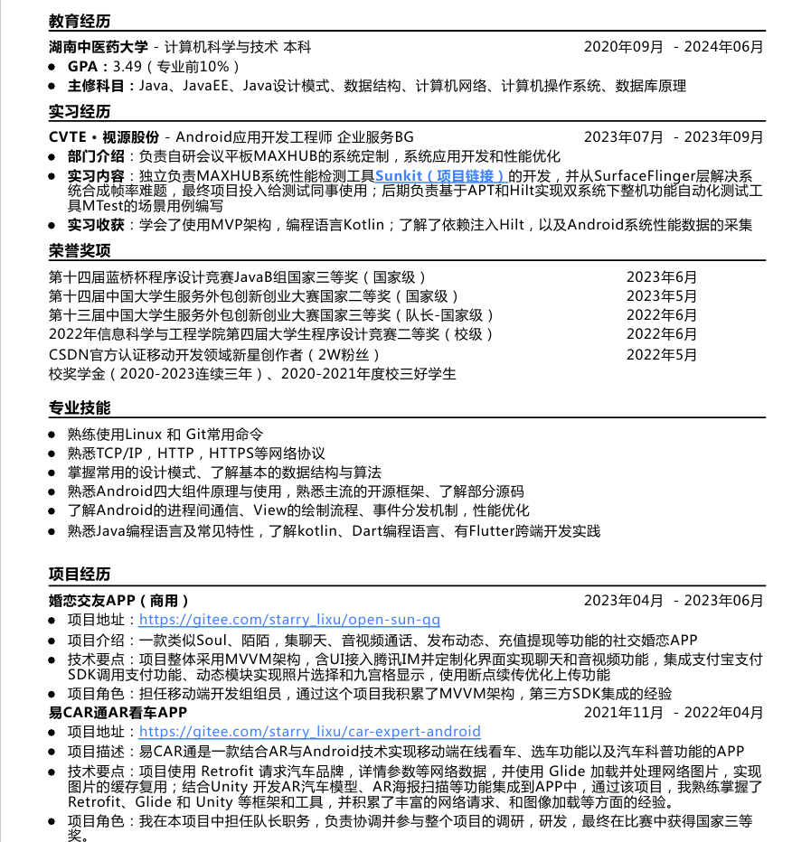
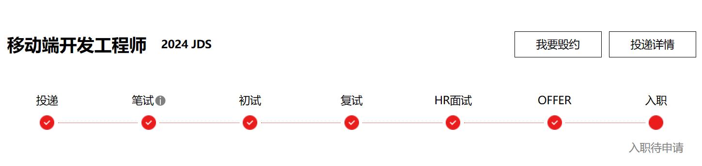
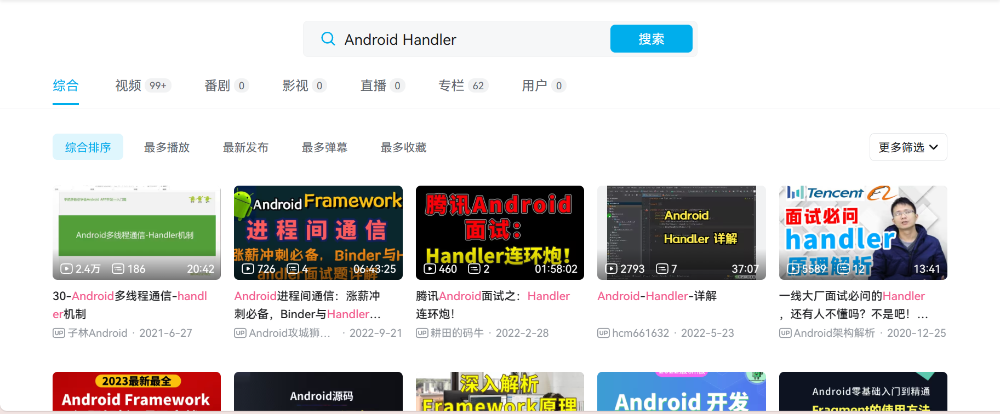
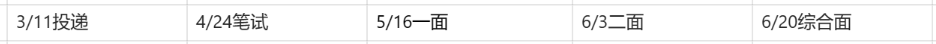

## AI帮写PPT
请帮我生成一份PPT，PPT的主题是大四学长给大二学弟分享找工作的经验。
PPT包括开篇自我介绍和致谢
第一部分是时间线，展示大二暑假，大三上，大三寒假，大三下三四月份，大三暑假，大四上这6个时间线
第二部分是介绍大二暑假，主要去确定自己的方向，以及学长本人是如何找到自己的工作方向的
第三部分是介绍大三上，主要介绍一份简历的组成部分包括荣誉奖项、专业技能和荣誉奖项，以及鼓励学弟学妹去参加比赛丰富自己的荣誉奖项和项目经历，可以罗列初参加比赛的好处（可以帮我总结提炼这个四点）：

1. 驱动自己去学习了一些课外的技术和知识
2. 可以收获一个项目，因为在面试中有一个环节是考察大家的项目经历，如果大家的简历上没有项目经历可以面试机会都拿不到。
3. 可以丰富自己的简历，然获奖经历上有东西可写，项目经历上也有话可说
4. 强化自己的算法能力，面试环节，大厂基本会有两到三轮技术面试，每一轮面试都会考查算法。

第四部分是大三寒假，主要讲述学长本人是如何准备实习生招聘面试的，以及在准备的过程中遇到的两个问题

1. 书看不懂，看完了不知道说了什么
2. 知识点太多，学了就忘

第五部分是大三下三四月份，主要介绍学长找实习的经验

1. 早投递，机会不等人
2. 先从小厂打怪升级
3. 找到实习不是面试的唯一目的
4. 持之以恒、不骄不躁

第六部分介绍大三暑假去暑假实习的重要性

1. 进入大公司最简单的方式
2. 丰富自己的简历
3. 有一个保底的工作，秋招更有底气

第七部分介绍大四上秋季招聘的特点，更看重简历的丰富度，面试难度比实习招聘更难，大厂考察计算机基础知识的比重更大。
第八部分总结，主要总结学长在一年的找工作经验中认为除了扎实复习面试知识以外很重要的三个点

1. 勤做笔记，一个发布保持更新的博客是自己技术能力和学习兴趣最好的证明
2. 不要轻易放弃，受到打击是肯定的，但是一定要相信自己
3. 然后就是组团学习，信息共享，互帮互助

第九部分，致谢


1. 自我介绍
2. 学习时间线
   1. 大二暑假

整理网课，写笔记，确定方向

   2. 大三上

参加比赛，蓝桥杯、服务外包比赛、课程设计

   3. 大三寒假

夯实基础，看面经了解问什么问题、看视频针对性的学习知识、看博客看书系统的学习

   4. 大三下三、四月份

准备简历，寻找实习经历，先拿小厂面试打怪升级，大厂面试

   5. 大三暑假

参加实习，尽可能的转正

   6. 大四上，九月、十月秋季招聘

参加秋季招聘，冲刺大厂


1. 怎么确定自己的方向？
2. 从哪些渠道了解岗位的信息，怎么知道我要学些什么？
3. 确定了就业方向，我应该怎么去学习，去学习哪些东西？
4. 怎么去编写简历，简历上没有东西写怎么办？
5. 大三下金三银四怎么准备找实习机会？
6. 大四上金九银十怎么准备？
7. 大四下怎么把我最后的机会？


1. 当前阶段的首要任务破除迷茫，确定方向
2. 面试的流程，需要准备的东西
## 开场白
大家好，我是20级计科二班黎旭，首先很感激胡老师能够给我这一次分享机会。
我主要是从大二下到大四上这个时间线，来分享我找工作的经历，在这个过程中踩过哪些坑，又收获了哪些心得。
首先我做一个小调研，就是大家清楚自己今后想要找工作、考研、保研还是考公等等，就是有考虑过自己毕业要干什么的同学举一下手。
还是有很多同学有自己的方向的。那我为什么要问这个问题呢，因为大二下的时候我也同样的遇到了这个问题，而且我觉得大二下是一个很关键的节点，因为这个时间点大学正好过完了一半，无论过去的两年是学的好还是不好，都完全有时间奋起直追。~~因为大二下其实是一个很关键的节点，正好大学过完了一半，大家或多或少的对自己所学的专业有了一定的认识。所以大家可以都思考一下这个问题，找到自己今后的方向。~~
## 大二暑假
那我在大二下的时候，我是怎么就确定我要找工作，又是怎么确定自己要找Android研发的工作的呢？
在这各过程中我其实做了两次选择。
1.工作还是读研？
首先我自己其实从大一开始就没打算读研，因为自己觉得读研就是一件很纯粹的事情，如果我读研是为了找一份工作，那我不如直接去找一份工作；而且自己也挺喜欢去研究一些新技术，编码能力也不错，所以很早就决定要找一份研发类型的工作。
2.那我又是怎么确定要找哪一个方向的工作的呢？或者说我是怎么选择Android方向的工作的？
这个问题其实困扰了我很久，因为自己大概是大一的时候就决定要找工作，但是又不知道找什么方向的工作，所以就是一直是一种有力无处使的状态。知道大二的时候开始，我开始在各种社交平台去关注和了解计算机行业就业的一些信息，比如计算机行业有哪些工种，普通本科学哪个方向好就业等等，计算机专业不喜欢编码可以选择哪些岗位，现在的就业趋势怎么样？找这个方向的工作要学习一些什么东西等等，就这样我慢慢的对计算机这个行业有了一个初步的认识，也知道了找哪个方向的工作要学些什么，要学到什么程度。
然后我就结合我们学院学长学姐们的成功案例，选择了Android这个方向，不过一开始也不是很坚定，因为自己在初学这门课程的时候，其实学的不是很好，自己课上能跟上老师的讲解，但是课后写作业就忘记是要用哪一个方法，或者不理解为什么要这么写。所以自己课后为了完成作业，我都重新把胡老师的录屏看了一遍，并且看的过程中，我一边看一遍记录，整理成了文章，这样有两个好处就是：

1. 下次又忘记了可以直接找自己写的文章，而不要又重新去找视频拖动进度条了。-
2. 整理的文章可以发布到CSDN或者掘金，一个持续更新的博客账号面试特别加分。

就这样胡老师关于Android的课程我差不多都是上了两遍，把那些视频整理成文章一开始也很耗时间，基本上一个上午就只能整理一次课的内容，但是每次收获都是很多的，例如之前不理解的逻辑我会用文字把它描述出来，不懂为什么要这么写，我会去查看一些资料，弄懂它，一些上课时老师只是简单介绍基本使用的框架，我会去了解一下它的更多用法。
就这样在这个过程中我就对Android产生了兴趣，然后也对写文章产生了兴趣，甚至那一段时间我一有时间就学新的技术，写文章记录怎么使用。就这样自然而然的决定了自己的就业方向就是Android应用开发。
所以大家如果也想找工作，但是又没有方向，那么也可以在各种平台去了解计算机行业的就业信息，因为只有了解了，才知道自己喜不喜欢，这个岗位适不适合自己，感不感兴趣。然后就是在学习的过程中坚持做笔记，最好就是整理成文章发布出来。


~~可能大家现阶段都处于一个迷茫的阶段，就是不知道自己毕业后到底想干嘛，能够干嘛。然后等到大三，大四开始跟风考研考公，然后考研考公失败又开始仓促的开始准备找工作，最后可能一事无成。~~
~~其实出现这样，就是没有一开始就清楚自己想要什么，所以不如现在就开始去思考自己想要做什么，是想读研深造，还是想工作就业。~~
~~可能大家还是疑惑，不知道自己想要考研还是想要就业，因为听大家说考研好像很难，好像找工作也很难，所以一开始大家什么都还没做，就开始焦虑和紧张了。~~
~~那么在大二的暑假，想考研的同学可以做的一件事情就是可以去了解考研，了解读研，考研要考些什么，我们可以报考哪些专业等等；~~
~~想找工作的同学，可以去了解我们能够选择的就业方向，除了什么是前端开发，什么是后端开发，客户端开发需要学习一些什么，不想做开发，我可不可以选择做运维，做网络安全，产品经理，项目经理等等。只有去了解了这些岗位的区别，需要去掌握的技术，我们才能结合自身去做选择，才不会那么迷茫。~~
~~那我是怎么确定自己的就业方向的呢？~~
~~我自己的话其实就是刚入学就很坚定的想去就业，所以比较早的就关注了行业的一些动态，什么方向好就业，什么方向热门。但是自己也并不是一开始就知道具体想从事什么岗位，只是想要做开发，想写代码。所以自己一开始也是跟着学校的课程按部就班的学习，在学习Android开发这门课程的时候，自己课上能跟上老师的讲解，但是课后写作业就忘记是要用哪一个方法，或者不理解为什么要这么写。所以自己课后为了完成作业，我都重新把胡老师的录屏看了一遍，并且看的过程中，我一边看一遍记录，整理成了文章，这样有一个好处就是，下次又忘记了可以直接找自己写的文章，而不要又重新去找视频拖动进度条了。~~
~~就这样胡老师关于Android的课程我差不多都是上了两遍，把那些视频整理成文章一开始也很耗时间，基本上一个上午就只能整理一次课的内容，但是每次收获都是很多的，例如之前不理解的逻辑我会用文字把它描述出来，不懂为什么要这么写，我会去查看一些资料，弄懂它，一些上课时老师只是简单介绍基本使用的框架，我会去了解一下它的更多用法。~~
~~就这样在这个过程中我就对Android产生了兴趣，然后也对写文章产生了兴趣，甚至那一段时间我一有时间就学新的技术，写文章记录怎么使用。就这样自然而然的决定了自己的就业方向就是Android应用开发。~~
~~所以大家如果现在迷茫，不知道自己想要干什么，可能不是想的不够多，而是做的不够多，可能还没开始就听别人说这样岗位压力大，加班多，已经快饱和了，不好就业了，然后还没开始就退缩了，但其实主要自己行动起来，扎扎实实的学好每一门课程，可能在这个过程中就找到了自己想要从事的工作方向。~~
## 大三上



到了大三上，确定了自己的方向，那接下的就是学习这个方向的知识。去丰富自己的简历。
因为在找工作的过程中，第一步就是投递简历，而一份简历最重要的三部分就是：

1. 荣誉奖项
2. 专业技能
3. 项目经历

专业技能我们可以突击去学习一两个月可能可以补上来，但是项目经历和荣誉奖项如果没有那就是很难在短时间去填补这两处的空白。
所以首先可以去丰富自己的荣誉奖项，那么大家在大三上的时候，可以积极的参加一些比赛，例如蓝桥杯、服务外包创新创业大赛，中国大学生程序设计大赛，湖南省程序设计大赛等等。
并且以我过往的经历来说，这几个比赛都还是比较好拿奖的，只要认真对待了，至少拿一个省级奖项是没有问题的。
而且参加比赛有四个好处

1. 驱动自己去学习了一些课外的技术和知识
2. 可以收获一个项目，因为在面试中有一个环节是考察大家的项目经历，如果大家的简历上没有项目经历可以面试机会都拿不到。
3. 可以丰富自己的简历，然获奖经历上有东西可写，项目经历上也有话可说
4. 强化自己的算法能力，面试环节，大厂基本会有两到三轮技术面试，每一轮面试都会考查算法。

我的话在大三的时候也是同时参加了蓝桥杯、服务外包比赛、中国大学生程序设计大赛，这样的话我至少就巩固了自己算法基础，也收获了两个项目。然后又还获奖了，那么简历上在个人荣誉和项目经历这一块就有东西可以写了。
## 大三寒假
大三的寒假是一个比较重要的节点，因为在之后大三上开学就是每年的春季招聘，它不仅招聘应届毕业生，还会招收大量的实习生。这个时候我们可以积极准备去参加春季招聘，提前找到一份实习。我个人觉得其实实习经历是整个简历中最重要的一个点，

1. 因为一个企业更希望招聘一个有实习经历的人，因为这样的人至少是有一定工作经验的。
2. 并且大部分的公司更愿意留任自己的实习生，而不是重新去招人。所以如果能提前进入大公司实习，好好表现，通过实习考核或者答辩就能提前拿到转正的offer。就不需要去参加之后的秋季招聘了。
3. 最重要的一点就是实习的面试一般就两轮技术面试，但是等到大家大四上的时候，面临的秋季招聘是招聘应届生，通常都是3轮面试，而且像一些比较核心的公司部门，例如微信团队就是四轮技术面试。所以拿到实习的offer，然后通过实习考核转正是进入大公司最简单的方式。

那么如何去准备呢，这是往届学长给我的建议。
```groovy
书籍：
Android开发艺术探索  三遍
博主
https://www.jianshu.com/u/383970bef0a0 
这个博主的Android文章质量很高 坚持把他Android的大部分文章看几遍
路线：
第一步：Android基础知识模块
1、四大组件建议结合Android艺术探索去看。
2、Android数据存储，跨进程通信的几种方式。
3、Android线程的几种方式，线程池,建议结合上面推荐博主的文章一起看。
4、核心的Handler原理、Loop循环必须要理解等，Android内存泄露的检测方式，如何避免OOM等
5、Android View绘制流程，事件分发流程 十分重要，必须要掌握。

第二步：Android网络模块
1、去看下知名的网络框架OkHttp/Retrofit，理解发送一个请求的过程，结合博客去理解。
2、计算机网络基础，如Tcp/Udp/Http/Https 
第三步：Android高级进阶
1、热修复了解一下原理即可
2、Android NDK开发，了解作用即可
3、Android Binder的作用和原理
第四步：
Java基础知识/数据结构/算法 ==》刷题和看书，数据结构需要理解到树 图可以理解，
重点在于HashMap以及数据同步
Java中的线程同步、锁升级等。
项目：其实现在做项目感觉不太来得及了，大概还有四五个月时间，能把上述几本书看几遍，再看一些博客，刷一些算法就可以了，
可以在github找一些高质量的Android项目，去理解他的实现，进行修改写道简历上，关键是：理解这个项目的核心技术。

```
那么我在执行这个学习路线的时候主要遇到了这些问题：

1. 书看不懂，看完了不知道说了什么

首先拿到一本书可以从头到尾逐页快速翻一遍，了解大概每一章都讲了什么，对书的整体的内容有一个把握。
然后再细读，遇到不懂的可以在b站针对性的找某一个知识点的视频学习，例如在看书的过程中对Handler原理不了解，那么可以直接就找这一个知识点的视频，一遍看不懂就多看几遍，最后再结合书中的内容，这样其实就不会因为看书太枯燥而放弃，也能比较轻松的弄懂这些比较难的知识点


2. 知识点太多，看了就忘。

这种情况，就需要有意识的做笔记，同一类的知识整理到一起，每次忘记，都可以直接去翻看自己的笔记，而不需要重新去看视频或者翻书找。
## 大三下三四月份

1. 早投递，机会不等人
2. 先从小厂打怪升级
3. 找到实习不是面试的唯一目的
4. 持之以恒、不骄不躁

1.**早投递，机会不等人**：这个时候是招聘的热点时期，大部分的公司都开始招人了，不过其实在2月份就已经可以开始投递简历了。所以大家可以一边复习一遍投递简历，而且不要担心自己还没准备好，然后想着，我再等一等再投简历吧，我再学一两天再投，结果可能就是又玩了两天，这样一日复一日，就容易拖延。而且会错过很多面试机会，因为你投了简历不是立马就会有面试，特别是大厂等了半个月，一个月的可能都有，因为我们毕竟不占学历优势，招聘的人也会对简历进行排序。
2.**先从小厂打怪升级，找到实习不是面试的唯一目的**：并且大家投简历也有技巧，一开始以投递小厂为主，可以直接在BOSS直聘上沟通，这种小公司的因为没有那些大厂热门，所以反馈会更及时，一般一两天就能收到面试机会，而且通过参加小公司面试可以攒经验，去体验一下面试的感受，每一次面试肯定都会遇到很多不会的问题，所以面试的过程中可以用手机录音，面完之后再复盘，去弄懂这些不会的问题。因为**面试不只是为了找到工作**，每一次面试其实都是在锤炼自己，找出自己的不足。
然后感觉面试这些小厂已经得心应手了，那就可以去面试大厂了，大厂一般反馈会比较久，可能1号投递简历，7号才会收到笔试，14号才会开始面试，所以大家在面试小厂的过程中就可以开始去大厂官网投递简历。同样也是要及时的复盘，这次不会的问题下次一定再遇到一定要能够流利的回答出来。
3.**持之以恒、不骄不躁：**虽然都说招聘的黄金时段是金三银四，但是我是在6月份才找到一份满意的暑假实习。这是我从投递到面上的整个时间线，跨越了整整3个多月。所以其实大家只要一直按部就班的学习，就算这一家公司没有通过，没关系还有下一家，或者面完之后，一直没有后续的通知，也不要泄气，坚持学下去，千万不要自暴自弃。

我之所以6月份拿到实习offer，其实有一部分原因就是
**1.阶段性的放弃和摆烂**，导致自己在下一个面试机会来的时候自己同样也没有做好准备，一样的没把握住。所以面试的过程中打击肯定是有的，大家千万不要阶段性的放弃，一定要有节奏的持续的复习，好好准备两个月，比边学边玩六个月收获的效益多得多，因为边学边玩，可能你之前准备的很好的东西就又忘了，等于什么也没学。
2.没有认真对待算法：第二个原因就是自己的算法没有认真对待，大厂的面试过程中，都会穿插算法题，会要大家在15分钟之内完成一道算法题。那怎么准备呢，其实在面试过程中遇到的算法题来来回回就是在这里面，所以大家提前把它刷几遍其实都没有很大的问题。我就是没有认真去刷，基本上都是写的磕磕绊绊所以有时候前面表现的挺好，但是编码写的很烂，面试官可能就会有一个印象，觉得我编码能力不行。
算法它很重要，但又不是那么重要，因为一般大厂还会有考察算法的习惯，而且如果在面试过程中，前面的问题和项目都说的很好，但是算法一般，大概率就不会通过。这是它重要。它不那么重要又是因为中小企业一般很少考察算法，所以如果一个同学算法很厉害Android基础知识很差，那么他大概率找不到工作，但是一个同学Android基础很好，算法很差，那么他至少能找到一份中小企业的工作。如果想进入大公司，那就必须是六边形战士。所以大家学习的时候也需要注意重点，算法能力不是一时能过提升的，时间不够的时候，千万不要死磕算法，先充分复习好基础知识。

## 大三暑假

1. 进入大公司最简单的方式，有一个保底的工作，秋招更有底气
2. 丰富自己的简历，有亮眼的实习经历
3. 有了实习的面试经历，提高秋招的成功率

大三下课程结束后，我就立马前往实习公司去进行暑假实习了。并且在两个月的实习考核中，我成功通过拿到转正的offer，那这个其实就很赚，因为相当于我大四可以过的很轻松了，不需要再考虑就业的问题，只需要上上课，把毕业设计写了。而且如果我想继续参加大四上的秋季招聘，我也有一份实习经历，更有面试优势。
所以大家尽量都在大三上就开始找实习，无论是大厂还是小厂的实习机会，只要是正规公司，及时没有转正，放到简历上，在秋季招聘中也是特别加分的。
而且就算没有拿到实习机会，至少自己有了很多失败的面试经验，在秋季招聘中，肯定会有意识的避开这些点，更好的表现，提高秋招的成功率。
~~那为什么要提前去实习呢，因为大部分的公司更愿意留任自己的实习生，而不是重新去招人。所以如果能提前进入大公司实习，好好表现，通过实习考核或者答辩就能提前拿到转正的offer。就不需要去参加之后的秋季招聘了。~~
~~而且实习的面试一般就两轮技术面试，但是秋季招聘是招聘应届生，通常都是3轮面试，像一些比较核心的公司部门，例如微信团队就是四轮技术面试。所以拿到实习的offer，然后通过实习转正是进入大公司最简单的方式。~~
## 大四上
等到大四开学就是金九银十秋季招聘，秋季招聘主要招聘应届毕业生，而不是实习生了。
不过虽然说是金九银十，但是其实每年的8月初就已经开始招聘了，所以秋季招聘其实在夏天就开始了。
招聘难度也是提高了一个档次。
首先简历这一关，如果你没有实习经验，那么大概率很难拿到大厂的面试机会。这也是为什么尽可能的去找一份暑假实习的原因，它能大大的提高在秋季招聘中的竞争优势。
然后就是面试的内容可能会更深入，更关注你的项目经历，我有好几场面试面试官都是直接从项目经历开始问。所以大家需要有意识的去打磨自己的项目，例如除了比赛的项目，每次课程设计的项目也可以写在简历中，一个项目一开始可能不过完善，但是你一直往上面加功能，做一些优化，甚至引入一些架构，一些设计模式等等，那么这个项目就有很多亮点可以和面试官说。就拿Android来说，大家都会使用recyclerview去做滚动列表，如果你的项目中有考虑到如果要还在上百条数据怎么去优化，或者说你了解recyclerview的原理，它有几层缓存机制；再或者多级recyclerview怎么实现共用缓存池等等，这些多可以扩展讲给面试官听，都是项目中的亮点。
再就是每一个面试中同样都会穿插考察大家的编码能力，会要大家在15分钟之内完成一道算法题。其实在面试过程中遇到的算法题来来回回就是在这里面，[https://leetcode.cn/studyplan/top-100-liked/](https://leetcode.cn/studyplan/top-100-liked/)所以大家提前把它刷几遍其实都没有很大的问题。~~算法它很重要，但又不是那么重要，因为一般大厂还会有考察算法的习惯，而且如果在面试过程中，前面的问题和项目都说的很好，但是算法一般，大概率就不会通过。这是它重要。它不那么重要又是因为中小企业一般很少考察算法，所以如果一个同学算法很厉害Android基础知识很差，那么他大概率找不到工作，但是一个同学Android基础很好，算法很差，那么他至少能找到一份中小企业的工作。如果想进入大公司，那就必须是六边形战士。~~
然后因为自己通过实习已经提前拿到了转正offer，在秋季招聘中就只投递了大厂，然后发现大厂的面试中其实有一个特点就是特点注重基础，对于操作系统，计算机原理层面的问题比重会更多，问的也更深。特别的考察大家的基础素养。
例如https的工作原理，它的加密策略；操作系统中的虚拟内存，多核心处理机怎么实现数据一致性等等。
## 总结
最后，自己的2023年其实不是在面试就是在准备面试，总结下来，除了精进自己的专业知识，算法能力。我认为其实还有几个特别重要的点：

1. 勤做笔记，一个发布保持更新的博客是自己技术能力和学习兴趣最好的证明
2. 不要轻易放弃，受到打击是肯定的，但是一定要相信自己

虽然都说是金三银四，金九银十，但是我是在6月底才找到满意的实习，在12月底才拿到京东的offer，所以一定要沉得住气，说不定哪天机会就来了。而且京东的第二轮面试官面试的第一个问题就是看我的博客，能写200多篇博客确实挺厉害的，之后的问题也是围绕着我里面的文章问的，那其实就都是自己熟悉的东西，因为就是自己写的。而且算法题也考察的就是自己写的一篇文章里的，所以面完这场，我就真的能切身的体会到到 过去的每一份付出都是有回报的，也特别感谢自己能够坚持写博客做笔记。

3. 然后就是组团学习，信息共享，互帮互助

在找工作的过程中，其实可以两三个找同一方向的同学一起互相交流，一起复习，就可以共享信息差了，而且每个人面试遇到的问题可以相互交流，这样学习的效率会更高，而且成功的同学可以帮助后来的同学，互帮互助，提高面试的成功率。就我身边而言，我们就有3位一起面试的同学，其中还包括以为原来在班上成绩倒数，但是最终拿到了上海小鹏汽车的offer的同学，所以只要努力，结伴而行，就能走的更远。

以上就是我的分享，最后希望大家也都能找到自己的方向，未来都能找到一份满意的工作，谢谢大家。
~~最后讲一下自己的经历，我是通过暑假实习就拿到了CVTE的转正offer，所以我秋招就比较有底气，只投了几家大公司，从九月份开始投递，直到12月31号我才拿到京东的offer，整整历经了四个月。所以一定要相信自己，不轻易放弃，没有面试机会的时候多总结，多自学；面试的时候大胆自信，把闪光点尽可能的展示给面试官，最后希望大家也都能找到自己的方向，找到一份满意的工作。~~


~~我先简单介绍一下现在开发岗位面试的结构，一般分为笔试-》基础知识初试-》项目综合复试-》HR面试-》谈薪发放offer~~
~~笔试一般就是两个小时的时间，以在线笔试的形式考察，题型包括选择题，填空题和算法题，像腾讯、字节跳动的话就全是算法题~~
~~基础知识初试，主要考察大家编程语言基础、Android基础知识、主流开源框架源码、计算机网络、操作系统、设计模式、以及算法~~
~~项目综合面试，在初始的基础上，主要结合大家简历上的项目提问和考察。~~
~~HR面试主要就是谈一谈个人情况、职业规划，考察大家的日常表达能力。~~
~~所以从这个面试的过程中就知道，大家至少要学习好一门编程语言，以Android举例就是需要学好Java和Android的基础知识。然后要认真对待自己的每一次课程设计。~~
~~参加比赛，蓝桥杯、服务外包比赛、课程设计~~
