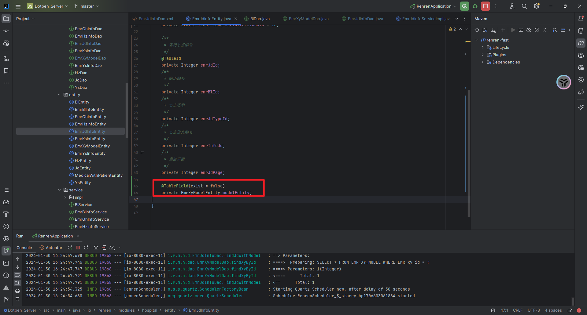
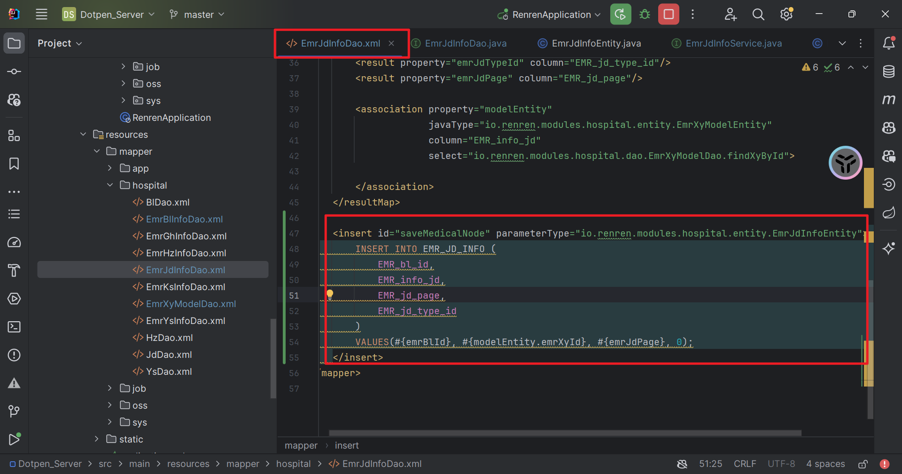
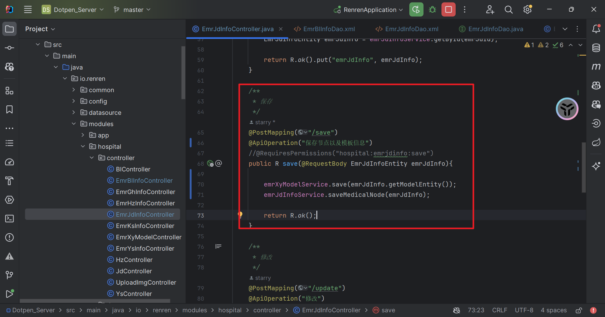

# 登录注册
登录注册分为医生端和用户端，需要分别写医生的登录注册和用户的登录注册。

# 科室

1. 查找所有的科室信息

# 挂号
一个患者可以选择某一个科室的医生挂号
需要患者id，医生id

1. 患者挂号接口，save接口
2. 根据患者id查询自己的挂号记录接口 
3. 根据医生id查询挂在自己门下的记录接口 级联 用户信息表 

# 医生

1. 根据 科室名称 查找该科室下的所有医生

# 病历

1. 根据患者编号查找对应的病历
2. 根据患者编号新建病历
# 病历节点

1. 根据病历编号查找其下的病历节点 级联 患者信息表
2. 根据病历节点编号找到对应的病历模板内容

这里使用了级联查询，

3. 根据病历节点id同步更新病历的详细模板信息

同样也使用级联更新

