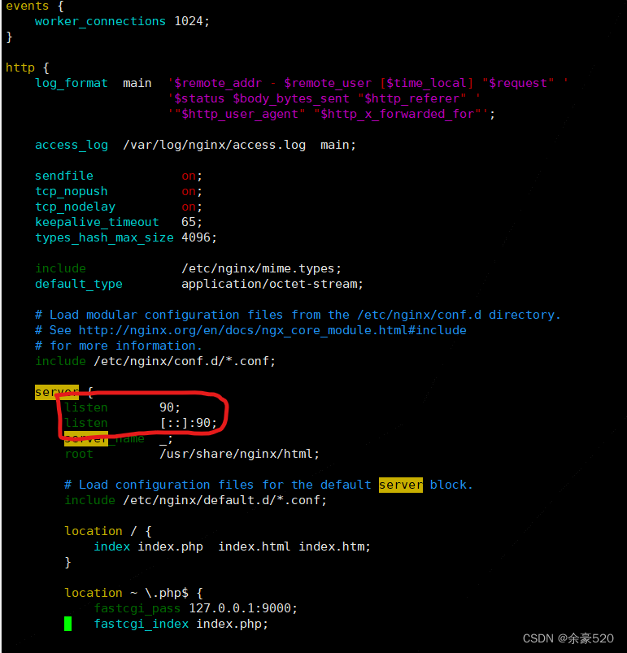
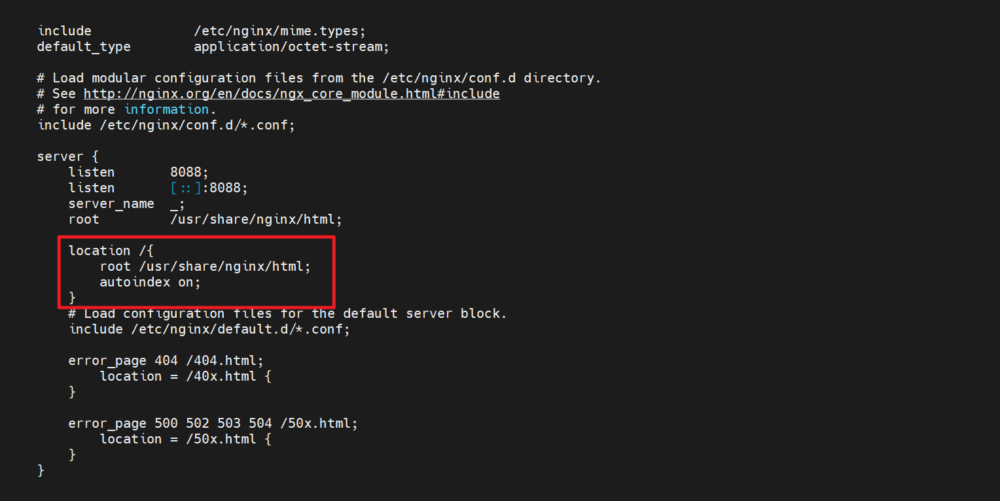
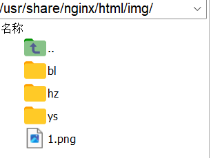
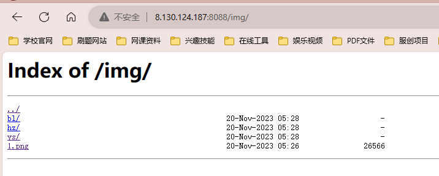
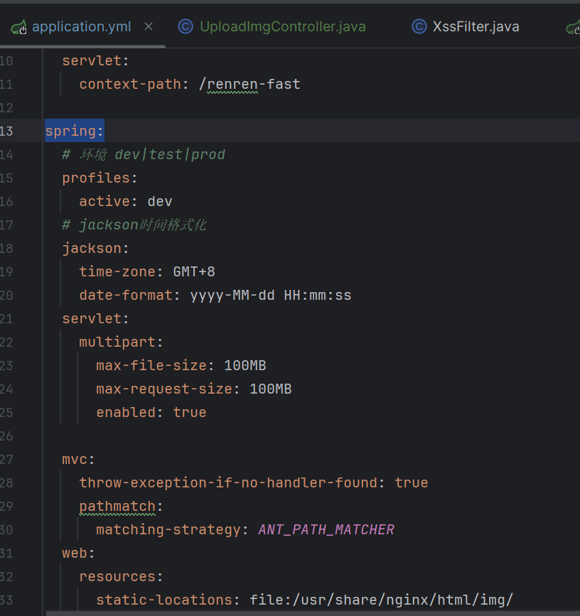

# scp传输文件
[https://cloud.tencent.com/developer/article/2322866](https://cloud.tencent.com/developer/article/2322866)
3.1 从Windows系统复制文件到Linux系统
要从Windows系统向Linux系统传输文件，可以使用以下命令：
```bash
scp C:\path\to\file.txt username@linux-server:/path/on/linux
```
```java
scp D:\JavaEE\JavaEEWorkSpace\DotPen\Dotpen_Server\target\renren-fast.jar root@8.130.124.187:/root
```
连接
```java
 ssh root@8.130.124.187
```
# 删除文件夹
[https://cloud.tencent.com/developer/article/2147694](https://cloud.tencent.com/developer/article/2147694)
```java
rm -rf dist/
```
# nginx的配置
配置文件目录
```java
cd /etc/nginx/
```
修改端口号
默认的资源文件目录
```java
cd /usr/share/nginx/html
```

## 配置静态图片路径


## Spring端上传文件，路径配置
因为最终搭建在服务器端，spring项目是在tomcat中运行，而前端项目是在nginx服务中运行，从spring接口上传的图片也都是在nginx映射目录下，所以在spring项目中同样也要指定默认的文件保存路径
```java

spring:
  web:
    resources:
      static-locations: file:/usr/share/nginx/html/img/
```


对应的上传接口代码
```java
@RestController
@RequestMapping("hospital/img")
@Api(value = "图片上传接口", tags = "图片上传接口")
public class UploadImgController {

    @PostMapping("")
    @ApiOperation("上传图片")
    public R  uploadImg(MultipartFile file){
        String dirs="/usr/share/nginx/html/img/";
        String imgName= UUID.randomUUID()+file.getOriginalFilename();
        try{
            file.transferTo(new File(dirs+imgName));
        }catch (IOException e){
            throw new RuntimeException(e);
        }
        return R.ok();
    }
}

```
# 查看端口
```java
lsof -i:8080
//杀死进程
kill -9 [pid]
```
# 挂起运行java项目
```java
nohup java -jar renren-fast.jar &
```
