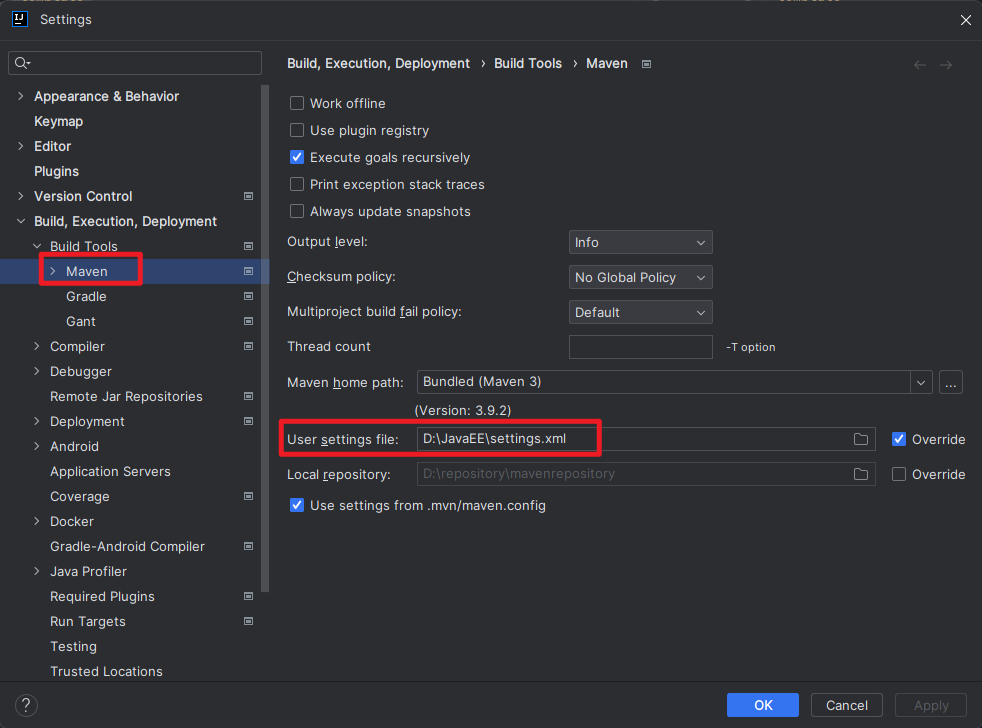
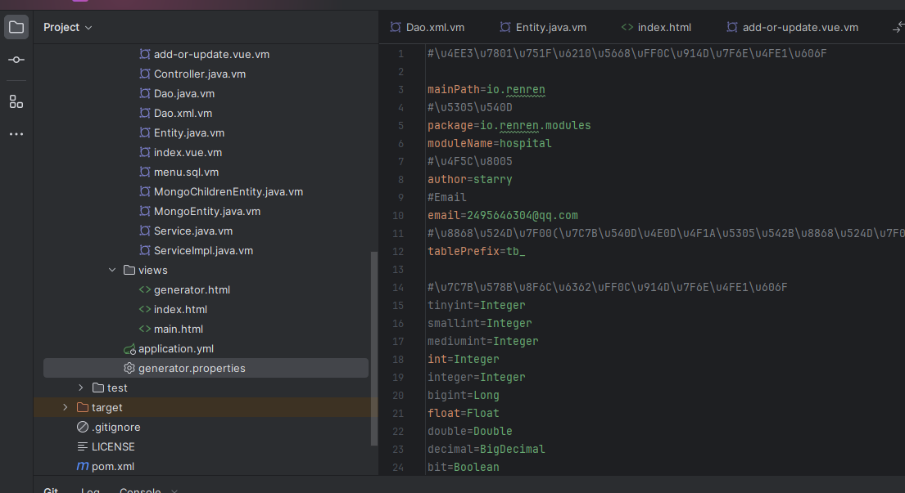
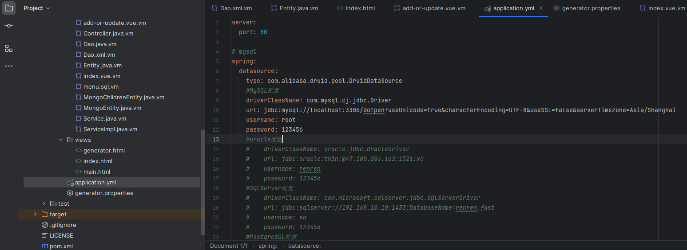
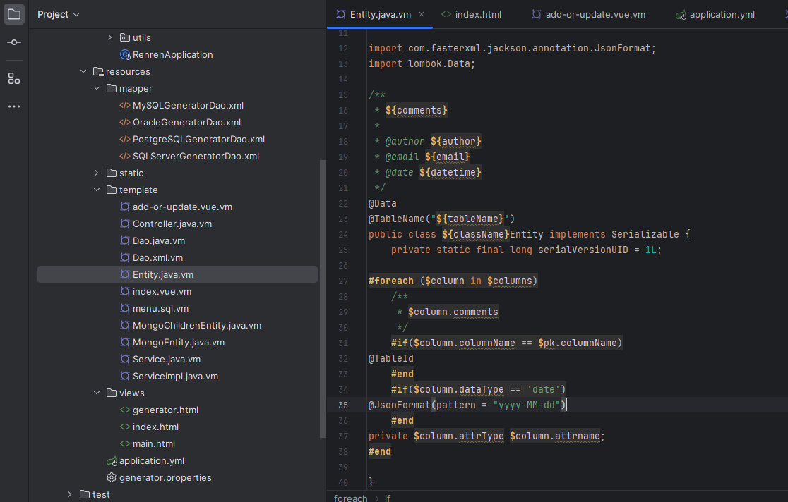
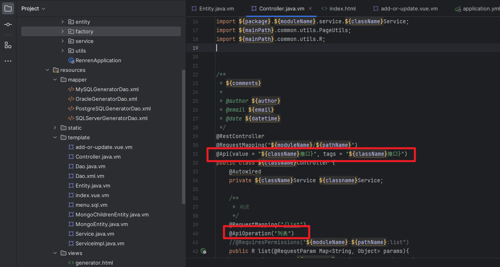
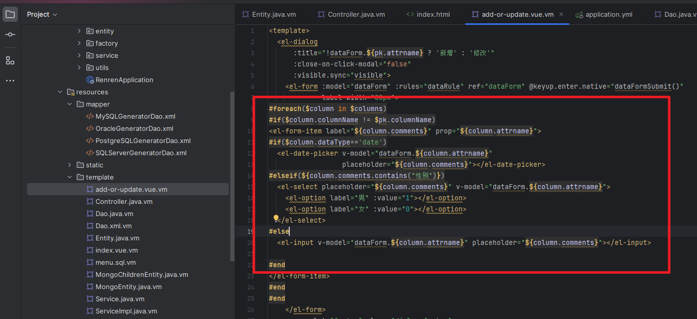
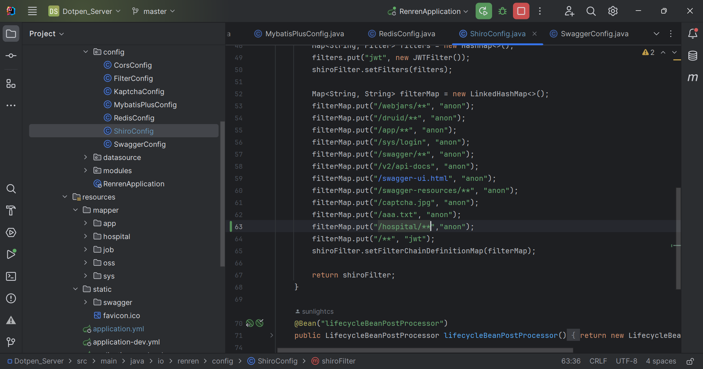
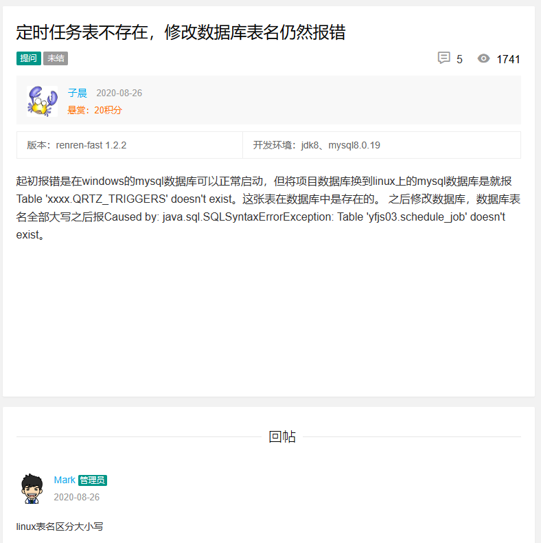

使用教程：[56.renrenfast使用_哔哩哔哩_bilibili](https://www.bilibili.com/video/BV1N8411g7nX/?spm_id_from=333.337.search-card.all.click&vd_source=2c2d0ce64b817501491ef975f77fea05)
博文教程：[https://blog.csdn.net/weixin_41212181/article/details/117752470](https://blog.csdn.net/weixin_41212181/article/details/117752470)
官方文档：[https://www.renren.io/](https://www.renren.io/)
开源地址：[https://gitee.com/renrenio](https://gitee.com/renrenio)

安装Node环境：[https://blog.csdn.net/zimeng303/article/details/112167688](https://blog.csdn.net/zimeng303/article/details/112167688)
swagger的使用：[https://blog.csdn.net/xhmico/article/details/125353535](https://blog.csdn.net/xhmico/article/details/125353535)


set global validate_password_policy=0;  #修改密码安全策略为低（只校验密码长度，至少8位）。 ALTER USER 'root'@'localhost' IDENTIFIED BY '@Lxth12345678';
# 依赖导入失败

配置成阿里云的镜像库


# 修改生成代码的包名


# 配置数据库


# 实体类Date转换失败的问题
增加注解，将String转成yyyy-MM-dd格式


# 控制层配置swagger


# 模板vue生成日期选择器


# token无效
新写的页面没有token访问不了，直接过滤掉。当然系统安全得不到保障了

# 数据库在Linux系统上报错

renrenfast Couldn't retrieve trigger: Table 'dotpen.QRTZ_TRIGGERS' doesn't exist

[https://www.renren.io/detail/13411](https://www.renren.io/detail/13411)

# 服务器操作
## 连接服务器
```java
ssh root@8.130.124.187
```
