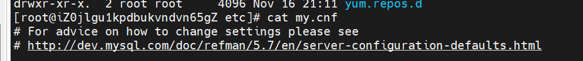

```java
MySQL报错1055解决办法：[Err] 1055 - Expression #1 of ORDER BY clause is not in GROUP BY clause and contains


```
[https://blog.csdn.net/qq_43514711/article/details/122041247](https://blog.csdn.net/qq_43514711/article/details/122041247)
在linux服务器中找到
在etc/my.cnf

在文件最后一行里添加
```java
sql_mode=STRICT_TRANS_TABLES,NO_ZERO_IN_DATE,NO_ZERO_DATE,ERROR_FOR_DIVISION_BY_ZERO,NO_ENGINE_SUBSTITUTION

```
重启数据库
```java
systemctl restart mysqld.service
```
查看数据库状态
```java
systemctl status mysqld.service
```
