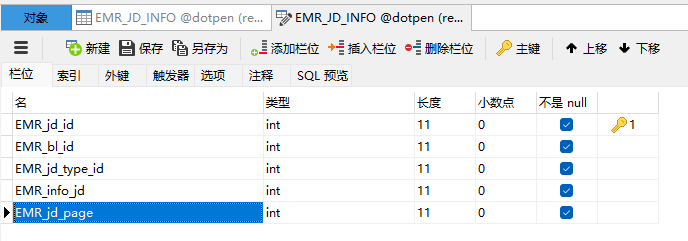
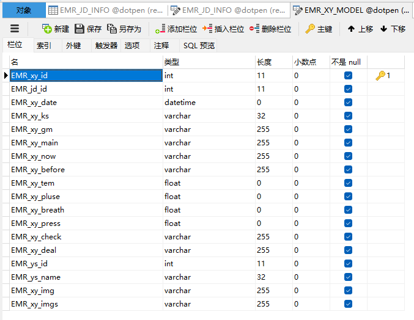

# 数据库的设计
病历节点表 EMR_JD_INFO

西医病历模板表 EMR_XY_MODEL

病历节点表中记录着EMR_info_jd字段，它与西医病历模板表中的EMR_xy_id一一对应

# 数据实体
## EMR_JD_INFO
注意字段，数据库中并没有这个字段
```java
@TableField(exist = false)
private EmrXyModelEntity modelEntity;
```
```java
package io.renren.modules.hospital.entity;

import com.baomidou.mybatisplus.annotation.TableField;
import com.baomidou.mybatisplus.annotation.TableId;
import com.baomidou.mybatisplus.annotation.TableName;

import java.io.Serializable;
import java.util.Date;

import com.fasterxml.jackson.annotation.JsonFormat;
import lombok.Data;

/**
 * @author starry
 * @email 2495646304@qq.com
 * @date 2024-01-29 17:53:46
 */
@Data
@TableName("EMR_JD_INFO")
public class EmrJdInfoEntity implements Serializable {
    private static final long serialVersionUID = 1L;

    /**
     * 病历节点编号
     */
    @TableId
    private Integer emrJdId;
    /**
     * 病历编号
     */
    private Integer emrBlId;
    /**
     * 节点类型
     */
    private Integer emrJdTypeId;
    /**
     * 节点信息编号
     */
    private Integer emrInfoJd;
    /**
     * 当前页面
     */
    private Integer emrJdPage;

    @TableField(exist = false)
    private EmrXyModelEntity modelEntity;

}

```
## EMR_XY_MODEL
```java
package io.renren.modules.hospital.entity;

import com.baomidou.mybatisplus.annotation.TableId;
import com.baomidou.mybatisplus.annotation.TableName;

import java.io.Serializable;
import java.util.Date;

import com.fasterxml.jackson.annotation.JsonFormat;
import lombok.Data;

/**
 * @author starry
 * @email 2495646304@qq.com
 * @date 2024-01-29 17:53:46
 */
@Data
@TableName("EMR_XY_MODEL")
public class EmrXyModelEntity implements Serializable {
    private static final long serialVersionUID = 1L;

    /**
     * 西医病历编号
     */
    @TableId
    private Integer emrXyId;
    /**
     * 病历节点编号
     */
    private Integer emrJdId;
    /**
     *
     */
    @JsonFormat(pattern = "yyyy-MM-dd HH:mm:ss")
    private Date emrXyDate;
    /**
     * 分诊科室
     */
    private String emrXyKs;
    /**
     * 过敏信息
     */
    private String emrXyGm;
    /**
     * 主诉
     */
    private String emrXyMain;
    /**
     * 现病史
     */
    private String emrXyNow;
    /**
     * 既往史
     */
    private String emrXyBefore;
    /**
     * 体温
     */
    private Float emrXyTem;
    /**
     * 脉搏
     */
    private Float emrXyPluse;
    /**
     * 呼吸
     */
    private Float emrXyBreath;
    /**
     * 血压
     */
    private Float emrXyPress;
    /**
     * 检查资料
     */
    private String emrXyCheck;
    /**
     * 处理人编号
     */
    private String emrXyDeal;
    /**
     * 处理人编号
     */
    private Integer emrYsId;
    /**
     * 处理人姓名
     */
    private String emrYsName;
    /**
     * 病历原件
     */
    private String emrXyImg;
    /**
     * 附加照片
     */
    private String emrXyImgs;

}
```
# mapper
## EmrJdInfoEntity
emrJdInfoMap是根据病历编号查找其下的病历节点需要的映射，property映射实体类中的属性，column映射数据库中的列

根据节点类型和节点信息id查找病历模板信息 这是一个级联查询，根据 病历节点表中记录的EMR_info_id字段去对应的一对一招西医病历模板表中的EMR_xy_id字段，联合到一起。
### 1.resultMap
首先构造实体属性与字段的映射关系
使用association，级联关键字

1. property对应实体中的modelEntity
2. javaType对应的实体类型
3. column要传入级联查询中的列
4. select级联查询
```xml
 <resultMap id="JdWithModelMap" type="io.renren.modules.hospital.entity.EmrJdInfoEntity">
    <result property="emrJdId" column="EMR_jd_id"/>
    <result property="emrBlId" column="EMR_bl_id"/>
    <result property="emrJdTypeId" column="EMR_jd_type_id"/>
    <result property="emrJdPage" column="EMR_jd_page"/>

    <association property="modelEntity"
      javaType="io.renren.modules.hospital.entity.EmrXyModelEntity"
      column="EMR_info_id"
      select="io.renren.modules.hospital.dao.EmrXyModelDao.findXyById">

    </association>
  </resultMap>
```
### 2.findXyById
在西医病历模板表的Mapper中，实现需要级联的查询
```xml
  <select id="findXyById" resultType="io.renren.modules.hospital.entity.EmrXyModelEntity"
          parameterType="Integer">
      SELECT *
      FROM EMR_XY_MODEL
      WHERE EMR_xy_id = #{infoId}
  </select>
```
### 3.findJdWithModel
```xml
 <!--根据节点类型和节点信息id查找病历模板信息-->
  <select id="findJdWithModel" resultMap="JdWithModelMap">
    SELECT * FROM EMR_JD_INFO
  </select>
```


```xml
<?xml version="1.0" encoding="UTF-8"?>
<!DOCTYPE mapper PUBLIC "-//mybatis.org//DTD Mapper 3.0//EN" "http://mybatis.org/dtd/mybatis-3-mapper.dtd">

<mapper namespace="io.renren.modules.hospital.dao.EmrJdInfoDao">

  <!-- 可根据自己的需求，是否要使用 -->
  <resultMap type="io.renren.modules.hospital.entity.EmrJdInfoEntity" id="emrJdInfoMap">
    <result property="emrJdId" column="EMR_jd_id"/>
    <result property="emrBlId" column="EMR_bl_id"/>
    <result property="emrJdTypeId" column="EMR_jd_type_id"/>
    <result property="emrInfoJd" column="EMR_info_jd"/>
    <result property="emrJdPage" column="EMR_jd_page"/>
  </resultMap>


  <!--根据病历编号查找其下的病历节点-->
  <select id="getJdByBlId" resultMap="emrJdInfoMap">
    SELECT
    *
    FROM
    EMR_JD_INFO
    WHERE
    EMR_bl_id = #{blId};
  </select>


  <!--根据节点类型和节点信息id查找病历模板信息-->
  <select id="findJdWithModel" resultMap="JdWithModelMap">
    SELECT * FROM EMR_JD_INFO
  </select>


  <resultMap id="JdWithModelMap" type="io.renren.modules.hospital.entity.EmrJdInfoEntity">
    <result property="emrJdId" column="EMR_jd_id"/>
    <result property="emrBlId" column="EMR_bl_id"/>
    <result property="emrJdTypeId" column="EMR_jd_type_id"/>
    <result property="emrJdPage" column="EMR_jd_page"/>

    <association property="modelEntity"
         javaType="io.renren.modules.hospital.entity.EmrXyModelEntity"
         column="EMR_info_jd"
         select="io.renren.modules.hospital.dao.EmrXyModelDao.findXyById">

    </association>
  </resultMap>
</mapper>

```
## EmrXyModelEntity
```java

<mapper namespace="io.renren.modules.hospital.dao.EmrXyModelDao">

	<!-- 可根据自己的需求，是否要使用 -->
    <resultMap type="io.renren.modules.hospital.entity.EmrXyModelEntity" id="emrXyModelMap">
        <result property="emrXyId" column="EMR_xy_id"/>
        <result property="emrJdId" column="EMR_jd_id"/>
        <result property="emrXyDate" column="EMR_xy_date"/>
        <result property="emrXyKs" column="EMR_xy_ks"/>
        <result property="emrXyGm" column="EMR_xy_gm"/>
        <result property="emrXyMain" column="EMR_xy_main"/>
        <result property="emrXyNow" column="EMR_xy_now"/>
        <result property="emrXyBefore" column="EMR_xy_before"/>
        <result property="emrXyTem" column="EMR_xy_tem"/>
        <result property="emrXyPluse" column="EMR_xy_pluse"/>
        <result property="emrXyBreath" column="EMR_xy_breath"/>
        <result property="emrXyPress" column="EMR_xy_press"/>
        <result property="emrXyCheck" column="EMR_xy_check"/>
        <result property="emrXyDeal" column="EMR_xy_deal"/>
        <result property="emrYsId" column="EMR_ys_id"/>
        <result property="emrYsName" column="EMR_ys_name"/>
        <result property="emrXyImg" column="EMR_xy_img"/>
        <result property="emrXyImgs" column="EMR_xy_imgs"/>
    </resultMap>

    <select id="findXyById" resultType="io.renren.modules.hospital.entity.EmrXyModelEntity"
            parameterType="Integer">
        SELECT *
        FROM EMR_XY_MODEL
        WHERE EMR_xy_id = #{infoId}
    </select>

</mapper>
```
