以下配置说明，设计linux的基本命令，及其相关环境的搭建，nginx的基本配置等。是后端同学需要掌握的基本素养。
# 服务器信息
云服务器IP地址：8.130.124.187
## 如何连接服务器？
在控制台使用命令：
```kotlin
ssh root@8.130.124.187
```
会提示要求输入密码：
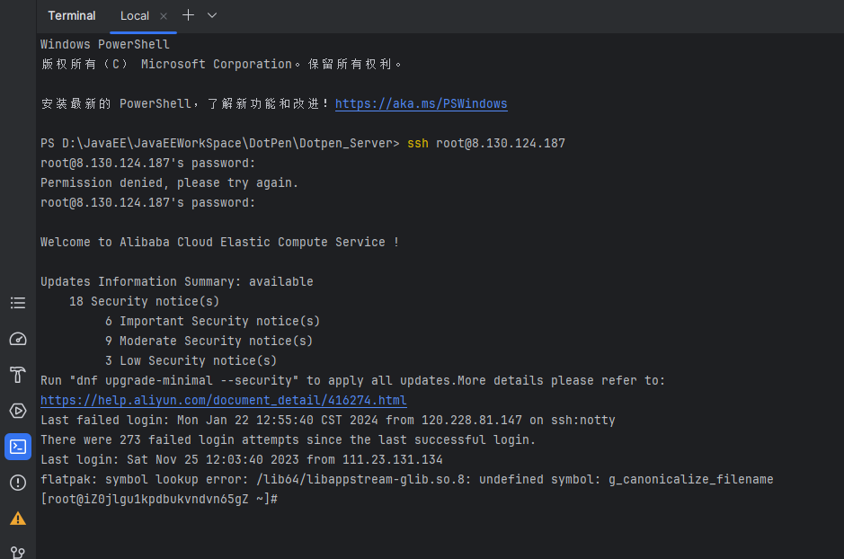
当然也可以使用linux课程上使用的连接linux服务器的xshell工具等等，只要能连上服务器即可，过程和方法不重要
## 已搭建的环境
jdk1.8+mysql+node.js+tomacat+
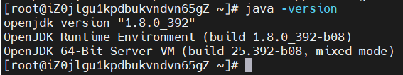
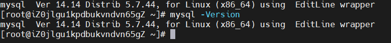
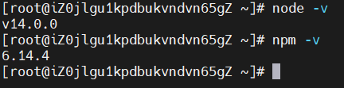
# 数据库
数据库已经部署在远程的服务器上，可以直接使用连接工具连接，例如我这里用的是navicat
按照如下填写信息：密码是`Lxth12345678`
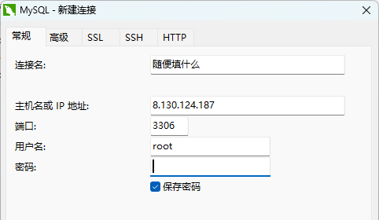
连接后可以看到数据库结构，tb_前缀开头的才是我建的表，其他的都是renren-fast框架自带的，不需要去修改
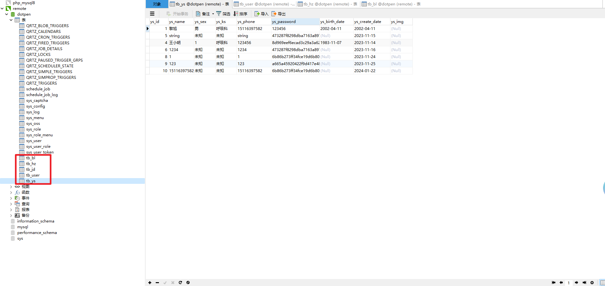
# 打包后端代码
使用package命令生成jar包
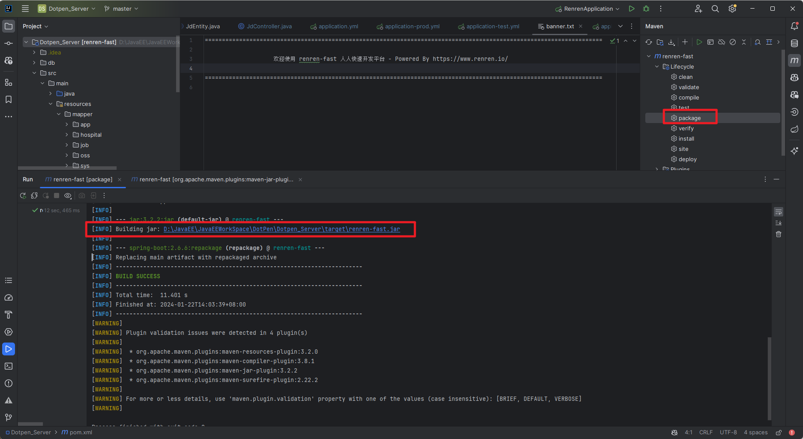
然后需要将jar包传输到liunx服务器上
 从Windows系统复制文件到Linux系统
要从Windows系统向Linux系统传输文件，可以使用以下命令：
```bash
scp [本地的文件路径] 终端用户名@终端IP地址:[终端路径]
```
例如如下命令就是将本地的jar包传输到远程服务器上的root目录下
```java
scp D:\JavaEE\JavaEEWorkSpace\DotPen\Dotpen_Server\target\renren-fast.jar root@8.130.124.187:/root
```
然后连接到远程服务器：
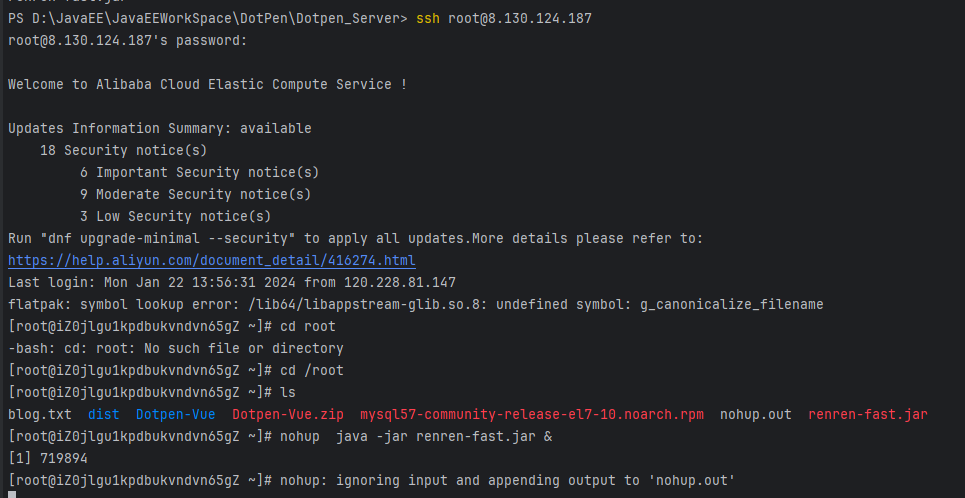

使用如下命令挂起并在后台运行项目，这样我们断开这一次远程连接，这次运行也不会终止
```bash
nohup  java -jar renren-fast.jar &
```
如果出现端口冲突的问题，可以先杀死占用8080端口的进程，再执行如上命令
```bash
lsof -i:8080
//杀死进程
kill -9 [pid]
```
在浏览器访问[http://8.130.124.187:8080/renren-fast/swagger-ui.html](http://8.130.124.187:8080/renren-fast/swagger-ui.html)页面成功说明项目成功跑在了服务器中

# 打包前端代码
修改配置文件，指定后端api接口的地址
如果需要在本机测试就使用：
```bash
http://localhost:8080/renren-fast
```
如果要打包发送到服务器，就需要用远程服务端的地址，修改为：
```bash
http://8.130.124.187:8080/renren-fast
```
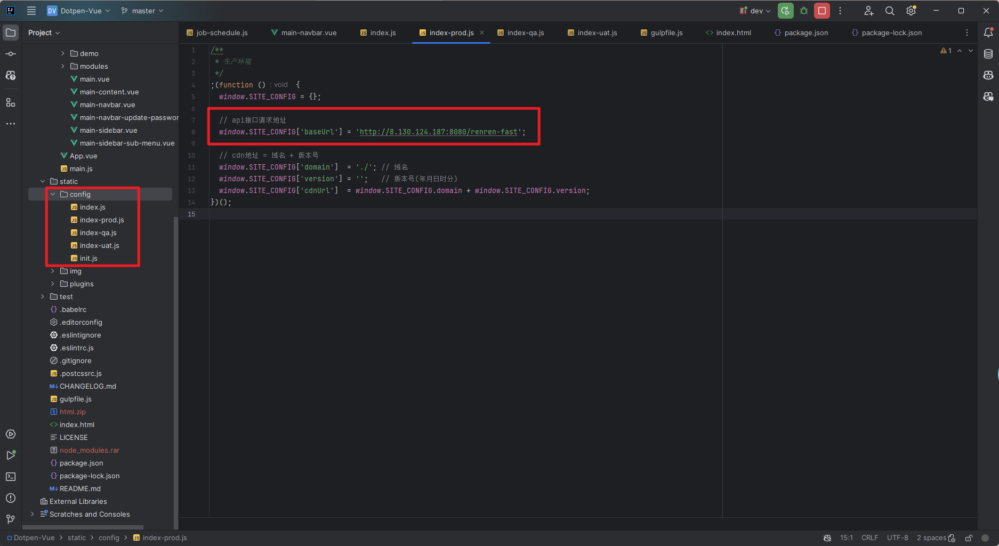
在管理台使用
```bash
npm run build
```
构建项目，成功后会生成一个dist文件夹
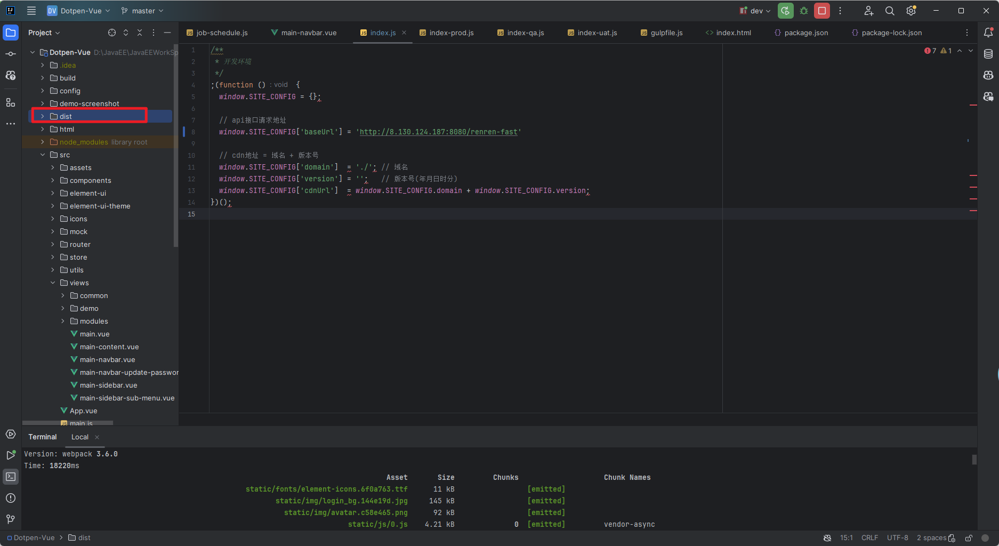
将他更名为 `html` 并压缩成zip包，通过ssh命令传输到远程服务器的 /usr/share/nginx 目录下
```bash
scp [压缩的zip包路径] root@8.130.124.187:/usr/share/nginx
```
然后连接远程服务器，进入 /usr/share/nginx 这个目录下
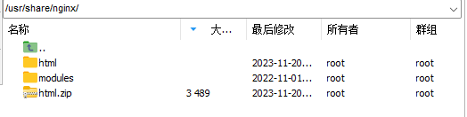
先将html中的img文件夹拷贝出来，里面保存的是我们上传的图片
然后再删掉原来的html文件，再将刚刚上传的html.zip解压
删除文件夹
[https://cloud.tencent.com/developer/article/2147694](https://cloud.tencent.com/developer/article/2147694)
```java
    rm -rf dist/
```
解压文件夹
```bash
unzip html.zip
```
访问[http://8.130.124.187:8088/](http://8.130.124.187:8088/) 看到如下界面则表示成功
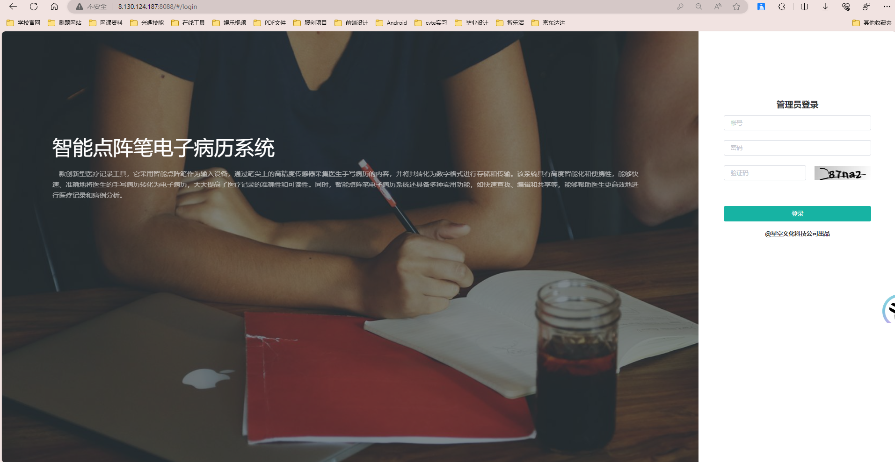
