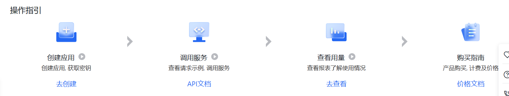
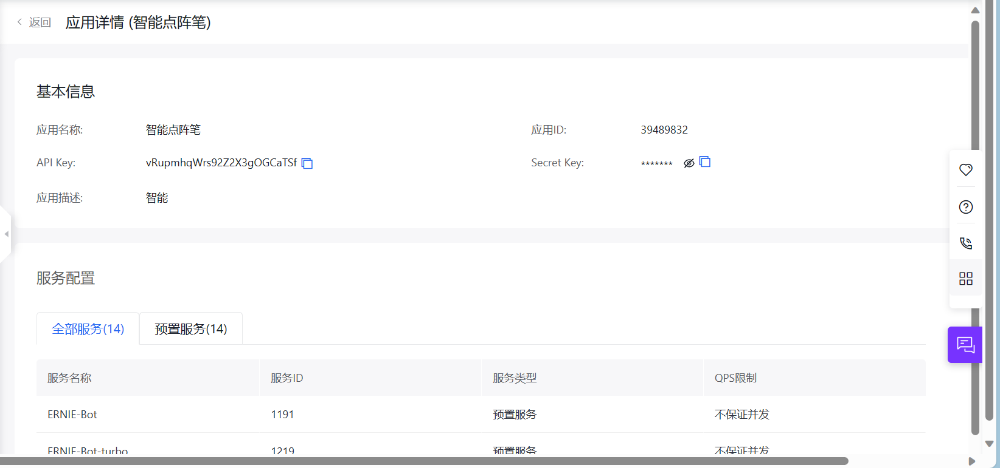

官方资料：AI能力免费体验：[AI产品免费试用_免费试用文字识别_语音转文字免费_免费图像识别-百度智能云](https://cloud.baidu.com/ai_free.html?track=developer_ai_free_dingbu)[API调用指南 - 千帆大模型平台 | 百度智能云文档](https://cloud.baidu.com/doc/WENXINWORKSHOP/s/flfmc9do2#api-%E8%B0%83%E7%94%A8%E6%B5%81%E7%A8%8B%E7%AE%80%E4%BB%8B)
示例代码：[服务与支持-自助服务-自助工具](https://console.bce.baidu.com/tools/?_=1696401973727#/api?product=AI&project=%E8%AF%AD%E9%9F%B3%E6%8A%80%E6%9C%AF&parent=%E9%89%B4%E6%9D%83%E8%AE%A4%E8%AF%81%E6%9C%BA%E5%88%B6&api=oauth%2F2.0%2Ftoken&method=post)
扣费界面：[百度智能云-管理中心](https://console.bce.baidu.com/billing/#/order/detail~uuid=ff7871473d1b4565b2324bafe0f0ad0f&serviceType=WENXINFACTORY)
代金券使用说明：[https://cloud.baidu.com/doc/Finance/s/Pjwvysvl8](https://cloud.baidu.com/doc/Finance/s/Pjwvysvl8)


# 初步接入
## 接入步骤

## 创建应用
创建一个应用，并获取AppID、API Key、Secret Key 等信息。
AppID：39489832
AppKey：vRupmhqWrs92Z2X3gOGCaTSf
SecretKey：SVvuLCqYyj5BH5eQgarxHydcycnsTd9h

## token接口
Java代码
```dart
package baidu.com;

import okhttp3.*;
import org.json.JSONObject;

import java.io.*;

class Sample {

    static final OkHttpClient HTTP_CLIENT = new OkHttpClient().newBuilder().build();

    public static void main(String []args) throws IOException{
        MediaType mediaType = MediaType.parse("application/json");
        RequestBody body = RequestBody.create(mediaType, "");
        Request request = new Request.Builder()
            .url("https://aip.baidubce.com/oauth/2.0/token?
                 client_id=vRupmhqWrs92Z2X3gOGCaTSf&
                 client_secret=SVvuLCqYyj5BH5eQgarxHydcycnsTd9h&
                 grant_type=client_credentials")
            .method("POST", body)
            .addHeader("Content-Type", "application/json")
            .addHeader("Accept", "application/json")
            .build();
        Response response = HTTP_CLIENT.newCall(request).execute();
        System.out.println(response.body().string());

    }
    
    
}
```
改写成Retrofit请求
```dart
"https://aip.baidubce.com/oauth/2.0/token?
  client_id=vRupmhqWrs92Z2X3gOGCaTSf&
  client_secret=SVvuLCqYyj5BH5eQgarxHydcycnsTd9h&
  grant_type=client_credentials"
```
接口的参数在url中，所以使用@Query注解
```dart
@Headers({
        "Accept:application/json",
        "Content-Type:application/json"
})
@POST("oauth/2.0/token")
Call<ChatTokenBean> getToken(
        @Query("client_id") String clientId,
        @Query("client_secret") String clientSecret,
        @Query("grant_type") String client_credentials
);
```
## 对话接口
官方Java样例代码
```dart
package baidu.com;

import okhttp3.*;
import org.json.JSONObject;

import java.io.*;

class Sample {
    public static final String API_KEY = "vRupmhqWrs92Z2X3gOGCaTSf";
    public static final String SECRET_KEY = "SVvuLCqYyj5BH5eQgarxHydcycnsTd9h";

    static final OkHttpClient HTTP_CLIENT = new OkHttpClient().newBuilder().build();

    public static void main(String []args) throws IOException{
        MediaType mediaType = MediaType.parse("application/json");
        RequestBody body = RequestBody.create(mediaType, "{\"messages\":[{\"role\":\"user\",\"content\":\"你好\"}]}");
        Request request = new Request.Builder()
            .url("https://aip.baidubce.com/rpc/2.0/ai_custom/v1/wenxinworkshop/chat/eb-instant?access_token=" + getAccessToken())
            .method("POST", body)
            .addHeader("Content-Type", "application/json")
            .build();
        Response response = HTTP_CLIENT.newCall(request).execute();
        System.out.println(response.body().string());

    }
    
    
    /**
     * 从用户的AK，SK生成鉴权签名（Access Token）
     *
     * @return 鉴权签名（Access Token）
     * @throws IOException IO异常
     */
    static String getAccessToken() throws IOException {
        MediaType mediaType = MediaType.parse("application/x-www-form-urlencoded");
        RequestBody body = RequestBody.create(mediaType, "grant_type=client_credentials&client_id=" + API_KEY
                + "&client_secret=" + SECRET_KEY);
        Request request = new Request.Builder()
                .url("https://aip.baidubce.com/oauth/2.0/token")
                .method("POST", body)
                .addHeader("Content-Type", "application/x-www-form-urlencoded")
                .build();
        Response response = HTTP_CLIENT.newCall(request).execute();
        return new JSONObject(response.body().string()).getString("access_token");
    }
    
}
```
改写成Retrofit代码：
首先定义一个接口，需要传入Body，所以使用@Body注解，并且接受一个RequestBody类型的参数
```dart
 @Headers({
        "Accept:application/json",
        "Content-Type:application/json"
})
@POST("/rpc/2.0/ai_custom/v1/wenxinworkshop/chat/eb-instant")
Call<ChatResponseBean> startChat(
        @Body RequestBody param,
        @Query("access_token") String accessToken
);
```
对话的参数使用一个实体类封装
这里有一个问题就是将实体对象映射成Json字符串时并不会严格按照对象属性定义的顺序解析，所以需要使用这个注解 `@JSONField(ordinal = 2)`标识映射的顺序
例如我创建的对象明明是：
```dart
chatBodyBean(role:"user",content:"你好")
```
但是使用` JSONObject.toJSONString(chatBodyBean)`映射成字符串时顺序是：
```dart
{"messages":[{"content":"你好","role":"user"}]}
```
```dart

/**
 * Package:com.eningqu.aipen.logic.model
 * Author:starr
 * Time:2023/10/4  16:56
 * Description: 对话主体的内容
 */
@NoArgsConstructor
@Data
public class ChatBodyBean {

    @SerializedName("messages")
    public List<MessagesDTO> messages;

    @Data
    public static class MessagesDTO {
        @SerializedName("role")
        @JSONField(ordinal = 1)
        public String role;
        @SerializedName("content")
        @JSONField(ordinal = 2)
        public String content;

        public MessagesDTO(String role,String content){

            this.role=role;
            this.content=content;
        }

    }
}

```
对话的响应参数同样使用一个实体类封装
```dart
package com.eningqu.aipen.logic.model;

import com.google.gson.annotations.SerializedName;

import lombok.Data;
import lombok.NoArgsConstructor;

/**
 * Package:com.eningqu.aipen.logic.model
 * Author:starr
 * Time:2023/10/4  14:52
 * Description: 智能问答接口响应实体类
 */
@NoArgsConstructor
@Data
public class ChatResponseBean {

    @SerializedName("id")
    public String id;
    @SerializedName("object")
    public String object;
    @SerializedName("created")
    public Integer created;
    @SerializedName("result")
    public String result;
    @SerializedName("is_truncated")
    public Boolean isTruncated;
    @SerializedName("need_clear_history")
    public Boolean needClearHistory;
    @SerializedName("usage")
    public UsageDTO usage;

    @NoArgsConstructor
    @Data
    public static class UsageDTO {
        @SerializedName("prompt_tokens")
        public Integer promptTokens;
        @SerializedName("completion_tokens")
        public Integer completionTokens;
        @SerializedName("total_tokens")
        public Integer totalTokens;
    }
}

```
具体使用对话接口，主要记得传递到接口的类型是RequestBody，而不是Json字符串，这些参数类型一定要一一对应。
```dart
//构造对话实体类，后面需要改为根据用户输入动态添加
  ChatBodyBean chatBodyBean=new ChatBodyBean();
  List<MessagesDTO> messagesDTOList=new ArrayList<>();
  messagesDTOList.add(new MessagesDTO("user","你好"));
  chatBodyBean.messages=messagesDTOList;
  //创建一个api接口
  Apis apis = ChatRetrofitUtils.getInstance().create(Apis.class);
  //将参数实体转换为RequestBody
  MediaType mediaType = MediaType.parse("application/json");
  RequestBody body = RequestBody.create(mediaType, JSONObject.toJSONString(chatBodyBean));
  //调用api接口
  Call<ChatResponseBean> call = apis.startChat(body, accessToken);
  call.enqueue(new Callback<ChatResponseBean>() {
      @Override
      public void onResponse(@NonNull Call<ChatResponseBean> call, @NonNull retrofit2.Response<ChatResponseBean> response) {
          String result = response.body().result;
          runOnUiThread(() -> mBinding.tvToken.setText(result));
      }

      @Override
      public void onFailure(Call<ChatResponseBean> call, @NonNull Throwable throwable) {
          ToastUtils.showShort(throwable.getMessage());
      }
  });
```

# 布局设计
接入文心一言需要实现一个对话聊天的界面
主要有几个难点：

1. RecyclerView怎么区分左边的气泡和右边气泡？设置两种布局ViewType
2. 如何对接文心一言的接口数据，设置到MsgAdapter中
3. 等到文心一言接口返回数据的过程中怎么给用户提示？加载动画
4. 返回的数据怎么逐个显示到界面上，呈现出像是生成的回答的视觉效果？子线程分段设置文字
5. 怎么刷新RecyclerView
## 两种布局
这个实现其实在《第一行Android代码》中有提到。
根据数据中的数据标识，上面有提到可以通过role字段区分时user还是assisant，来区分是提问还是回答，对应左部布局和右部布局。具体可见重写`getItemViewType`和`onCreateViewHolder`方法
```java
 @Override
public int getItemViewType(int position) {
    ChatBodyBean.MessagesDTO msg=list.get(position);
    if(TextUtils.equals(msg.role,"user")){
        return 0;//user-right
    }else{
        return 1;//assistant-left
    }
}

@NonNull
@Override
public RecyclerView.ViewHolder onCreateViewHolder(@NonNull ViewGroup viewGroup, int viewType) {
    if(viewType==1){
        View view= LayoutInflater.from(viewGroup.getContext()).inflate(R.layout.item_msg_left,viewGroup,false);
        return new LeftViewHolder(view);
    }else{
        View view=LayoutInflater.from(viewGroup.getContext()).inflate(R.layout.item_msg_right,viewGroup,false);
        return new RightViewHolder(view);
    }
}
```
## 数据的摄入
从网络端请求的数据格式是如此的：
```java
{
  "messages": [
    {
      "role": "user",
      "content": "你好"
    },
    {
      "role": "assistant",
      "content": "你好，有什么我可以帮助你的吗？"
    },
    {
      "role": "user",
      "content": "你好"
    }
  ]
}
```
因此在适配器中只需要拿到这一组数据即可，也就是`List<ChatBodyBean.MessagesDTO> list;`根据其中的role就可以区分是提问还是回答，从而选择是`LeftViewHolder`还是`RightViewHolder`
## 加载动画
因为我们发送问题后需要将问题以Json格式发送到接口中请求网络获得回答的数据，所以在等待数据返回的间隙中，我们需要设置一个用户视觉交互来优化设计，那就是聊天气泡的加载动画
具体看[加载动画的实现](https://www.yuque.com/starryluli/dotpen/uv5caleix6smcsfk)
## 子线程分割数据
最终返回的数据可能是一长串，如果直接显示在界面上那么会很突兀，需要逐行的显示，给用户交互式体验
具体实现在开辟子线程的代码中，通过子线程去沉睡20ms，然后逐个的显示返回的字符。
```java
call.enqueue(new Callback<ChatResponseBean>() {
            @Override
            public void onResponse(@NonNull Call<ChatResponseBean> call, @NonNull Response<ChatResponseBean> response) {
                String result = response.body().result;
                messagesDTOList.add(new MessagesDTO("assistant",""));//将回答添加到实体中，为下次提问做准备

                runOnUiThread(() -> {
                    //移除占位view
                    mBinding.llPlaceholder.setVisibility(View.GONE);
                    mBinding.ivPlaceholder.setVisibility(View.GONE);
                    mBinding.tvPlaceholderMsgLeft.stopAnimation();

                });


                int length=result.length();
                final int[] index = {0};
                new Thread(new Runnable() {
                    @Override
                    public void run() {
                        while (index[0] <length){
                            try {
                                Thread.sleep(20);
                                runOnUiThread(new Runnable() {
                                    @Override
                                    public void run() {
                                        messagesDTOList.get(messagesDTOList.size()-1).content=result.substring(0, index[0]);
                                        //刷新列表
                                        adapter.notifyDataSetChanged();
                                        adapter.notifyItemInserted(messagesDTOList.size()-1);
                                        recyclerView.scrollToPosition(messagesDTOList.size()-1);
                                        mBinding.edContent.setText("");
                                    }
                                });
                                index[0]++;
                            }catch (Exception e){
                                e.printStackTrace();
                            }
                        }
                    }
                }).start();

            }

            @Override
            public void onFailure(Call<ChatResponseBean> call, @NonNull Throwable throwable) {
                ToastUtils.showShort(throwable.getMessage());
            }
        });
```
## 刷新列表
在上面的代码中其实也看到了刷新列表的实现。在每次更新数据源`messagesDTOList`，我们都应该去刷新列表，局部刷新即可。
```java
//刷新列表
adapter.notifyDataSetChanged();
adapter.notifyItemInserted(messagesDTOList.size()-1);
recyclerView.scrollToPosition(messagesDTOList.size()-1);
mBinding.edContent.setText("");
```
