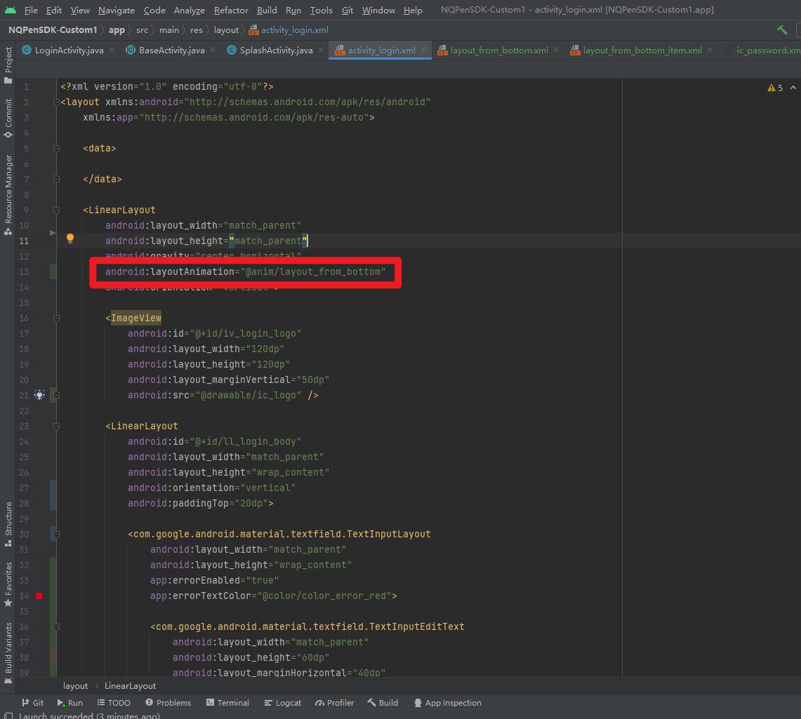

materialbutton-一种可设置圆角和图标的原生控件
[https://juejin.cn/post/6965442836787855390](https://juejin.cn/post/6965442836787855390)
TextInputLayout-一种样式更多样的输入框控件
[https://blog.csdn.net/W41ted/article/details/121594975](https://blog.csdn.net/W41ted/article/details/121594975)
# 设置入场动画
设置activity的入场动画
设置LoginActivity从屏幕的底部进入
```powershell
<?xml version="1.0" encoding="utf-8"?>
<layoutAnimation xmlns:android="http://schemas.android.com/apk/res/android"
    android:animation="@anim/layout_from_bottom_item"
    android:animationOrder="normal"
    android:delay="15%">
</layoutAnimation>
```
```powershell
<?xml version="1.0" encoding="utf-8"?>
<set xmlns:android="http://schemas.android.com/apk/res/android"
    android:duration="400">
    <translate
        android:fromYDelta="50%p"
        android:interpolator="@android:anim/accelerate_decelerate_interpolator"
        android:toYDelta="0"/>
    <alpha
        android:fromAlpha="0"
        android:interpolator="@android:anim/accelerate_decelerate_interpolator"
        android:toAlpha="1"/>
</set>
```

# Dialogx
```powershell
前提：
implementation 'androidx.appcompat:appcompat:1.2.0'
implementation 'com.google.android.material:material:1.3.0'

依赖：
def dialogx_version = "0.0.48"
implementation "com.github.kongzue.DialogX:DialogX:${dialogx_version}"
implementation "com.kongzue.dialogx.style:DialogXIOSStyle:${dialogx_version}"//ios风格
```
