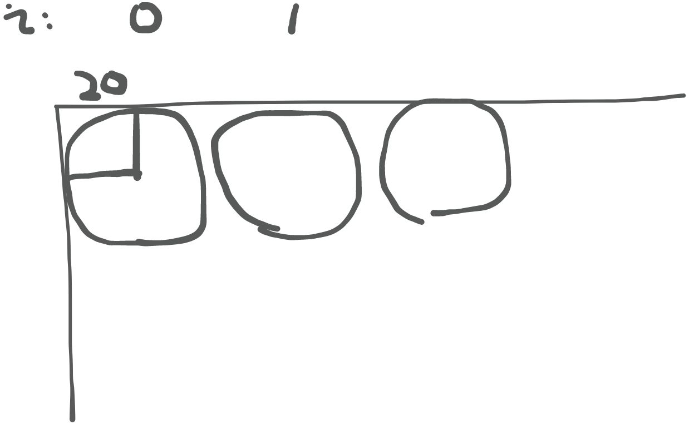
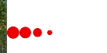
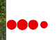
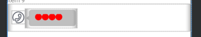

需求是希望实现一个聊天界面，对方正在回消息的时候，展示一个播放正在加载动画的TextView，网络请求收到了对方的消息就展示接收到的信息。所以自定义了一个带加载动画的TextView。
自定义一个加载动画
首先需要继承TextView类
然后主要分为4步：

1. 初始化画笔
2. 画出加载的圆圈
3. 通过属性动画，控制圆圈的大小
4. 提供对外方法，停止动画
```java
public class LoadingView extends androidx.appcompat.widget.AppCompatTextView {
}
```

1. 定义画笔

注意要点是打开抗锯齿
```java
void init(){
    paint=new Paint();
    paint.setColor(Color.RED);
    paint.setAntiAlias(true);
    // animation();
}
```

2. 在onDraw方法中画圆圈

一共画了4个圆圈（num=4）,每个圆圈的中心坐标不一样
第一个的x坐标是1倍radius，那么第二个的应该是3倍radius，第三个的应该是5倍radius。为了每个圆圈之间有间隙，所以我单独加了20的间距
其中的`radius*scales[i]`是关键，控制着每个圆圈的半径大小，只需要通过动画控制`scales[i]`的值变化就能间接控制圆圈的大小，实现动画效果
```java
@Override
public void draw(Canvas canvas) {
    super.draw(canvas);
    for(int i=0;i<num;++i){
        float x=20+(2*i+1)*(radius);
        float y=radius;
        canvas.drawCircle(x,y,radius*scales[i],paint);
    }
}
```


3. 属性动画，控制`scales[i]`的值
```java
public void animation(){
    int[] delays=new int[]{120,240,360,480};

    for(int i=0;i<4;++i){
        ValueAnimator scaleAnim=ValueAnimator.ofFloat(1,0.3f,1);
        scaleAnim.setDuration(750);
        scaleAnim.setRepeatCount(-1);
        scaleAnim.setStartDelay(delays[i]);
        int index = i;
        scaleAnim.addUpdateListener(animation -> {
            scales[index]= (float) animation.getAnimatedValue();
            postInvalidate();
        });
        scaleAnim.start();
    }
}
```

4. 停止动画

迭代每一个scaleAnim一一取消动画即可
```java
public void stopAnimation(){
    for(int i=0;i<valueAnimators.size();++i){
        valueAnimators.get(i).cancel();
    }
}
```
效果

最终的全部代码
```java
package com.eningqu.aipen.ui.view;

import android.animation.ValueAnimator;
import android.content.Context;
import android.graphics.Canvas;
import android.graphics.Color;
import android.graphics.Paint;
import android.util.AttributeSet;

import androidx.annotation.Nullable;

import java.util.ArrayList;
import java.util.List;

/**
 * Package:com.eningqu.aipen.ui.view
 * Author:starr
 * Time:2023/11/8 10:04
 * Description: 
 */
public class LoadingView extends androidx.appcompat.widget.AppCompatTextView {

    float num=4;
    float radius=20;
    Paint paint;

    float[] scales={1,1,1,1};

    List<ValueAnimator> valueAnimators=new ArrayList<>();

    public LoadingView(Context context) {
        super(context);
        init();
    }

    public LoadingView(Context context, @Nullable AttributeSet attrs) {
        super(context, attrs);
        init();
    }

    public LoadingView(Context context, @Nullable AttributeSet attrs, int defStyleAttr) {
        super(context, attrs, defStyleAttr);
        init();
    }

    void init(){
        paint=new Paint();
        paint.setColor(Color.RED);
        paint.setAntiAlias(true);
        animation();
        this.setMinWidth((int) (12*radius));
        this.setMinHeight((int) (2*radius));
    }


    @Override
    public void draw(Canvas canvas) {
        super.draw(canvas);
        for(int i=0;i<num;++i){
            float x=20+(2*i+1)*(radius);
            float y=radius;
            canvas.drawCircle(x,y,radius*scales[i],paint);
        }
    }

    public void animation(){
        int[] delays=new int[]{120,240,360,480};

        for(int i=0;i<4;++i){
            ValueAnimator scaleAnim=ValueAnimator.ofFloat(1,0.3f,1);
            valueAnimators.add(scaleAnim);
            scaleAnim.setDuration(750);
            scaleAnim.setRepeatCount(-1);
            scaleAnim.setStartDelay(delays[i]);
            int index = i;
            scaleAnim.addUpdateListener(animation -> {
                scales[index]= (float) animation.getAnimatedValue();
                postInvalidate();
            });
            scaleAnim.start();
        }
    }

    public void stopAnimation(){
        for(int i=0;i<valueAnimators.size();++i){
            valueAnimators.get(i).cancel();
        }
    }
}

```
在布局中使用
```java
<LinearLayout
    android:id="@+id/linearLayout"
    android:layout_width="match_parent"
    android:layout_height="wrap_content"
    android:padding="@dimen/dp10"
    android:paddingEnd="@dimen/dp_40"
    app:layout_constraintBottom_toTopOf="@+id/constrain_1"
    app:layout_constraintEnd_toEndOf="parent"
    app:layout_constraintStart_toStartOf="parent">

    <ImageView
        android:id="@+id/iv_placeholder"
        android:layout_width="wrap_content"
        android:layout_height="wrap_content"
        android:layout_marginTop="@dimen/dp_5"
        android:src="@drawable/ic_phone"
        android:visibility="visible" />

    <LinearLayout
        android:id="@+id/ll_placeholder"
        android:layout_width="wrap_content"
        android:layout_height="wrap_content"
        android:background="@drawable/bubble_128_left"
        android:gravity="left"
        android:orientation="horizontal"
        android:visibility="visible"
        app:layout_constraintStart_toStartOf="parent"
        app:layout_constraintTop_toTopOf="parent">

        <com.eningqu.aipen.ui.view.LoadingView
            android:id="@+id/tv_placeholder_msg_left"
            android:layout_width="wrap_content"
            android:layout_height="wrap_content"
            android:layout_gravity="center"
            android:layout_marginLeft="@dimen/dp_15"
            android:layout_marginRight="@dimen/dp10" />
    </LinearLayout>
</LinearLayout>
```

反思与问题：

1. 没有提供处理设置颜色的方法
2. 对最终显示文字和圆圈没有做好统一处理，文字出来了，圈圈还在：解决的思路，关闭动画时，将圈圈缩放到0
3. 优化加载动画在TextView中居中显示[https://www.jianshu.com/p/d3667fab17bf](https://www.jianshu.com/p/d3667fab17bf)，解决思路，考虑到ascent 的偏移

