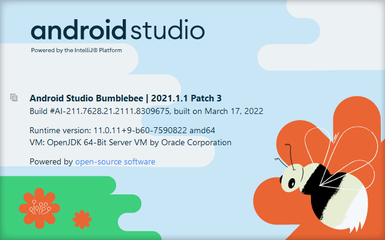
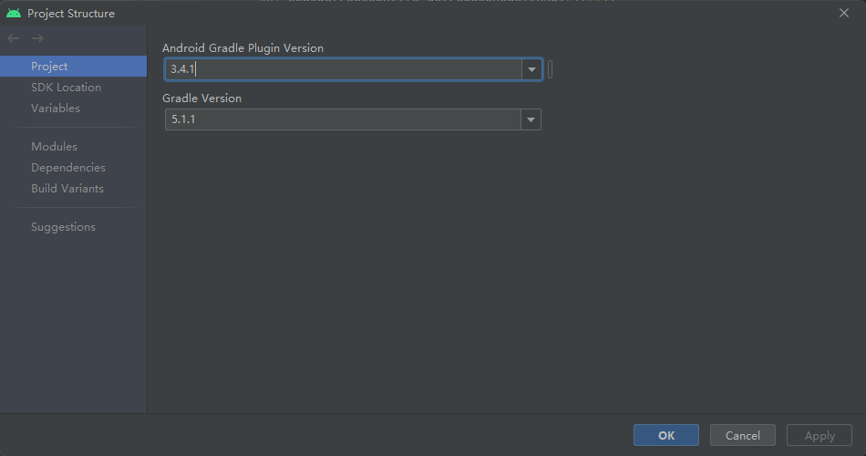
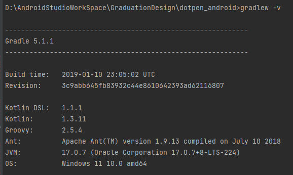

# 项目基础环境

# 项目依赖
**开发语言：Java**
**网络请求：okhttp    **+retrofit+RxJava2
**图片加载：Glide**
开屏动画：Lottie
弹窗：DialogX
刷新列表：SmartRefreshLayout
图片选择：pictureselector
九宫格：AssNineGridView
图片预览：PhotoView
轮播图：banner

# 

