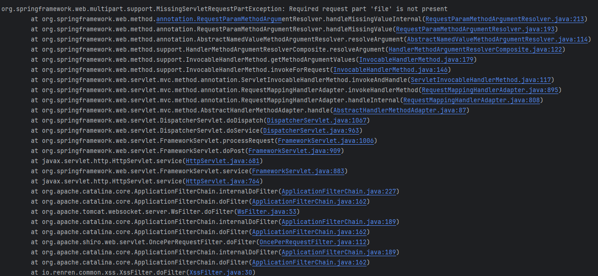
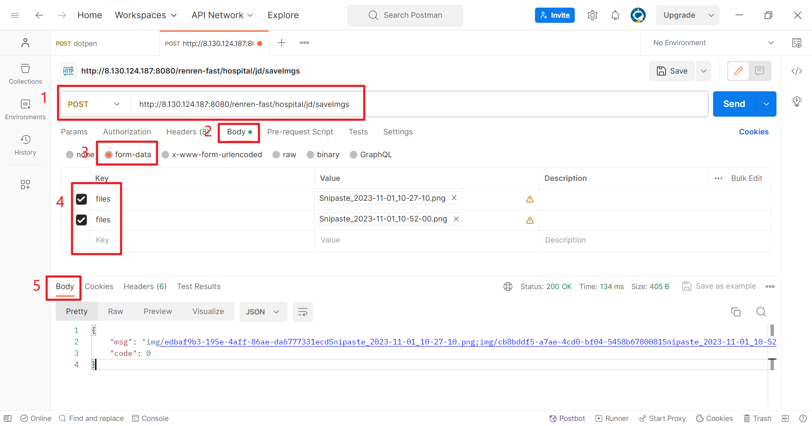

更多关于Retrofit接口定义的知识如下：[https://www.jianshu.com/p/74b7da380855](https://www.jianshu.com/p/74b7da380855)
# 前言
阅读门槛：掌握Retrofit的使用
遇到的问题：需要将Bitmap图片以文件的格式上传至后端服务器
从Android端上传Bitmap图片有很多中方式，例如转换成字节流的格式上传。
不过我这里的需求有些不同，我想复用文件上传的接口，所以期望是Android客户端需要将一张Bitmap格式的图片保存到后端

# 单文件上传
## 后端代码
```java
 /**
 * 保存节点信息，带图片
 */
@PostMapping("/saveWithImg")
@ApiOperation("病历图片上传")
public R uploadSingleFile(
        @RequestParam(value = "file") MultipartFile file) {
    //1.文件保存的路径
    String dirs = "/usr/share/nginx/html/img/";
    //2.重命名文件名
    String imgName = UUID.randomUUID() + file.getOriginalFilename();
    //3.保存文件
    try {
        file.transferTo(new File(dirs + imgName));
    } catch (IOException e) {
        throw new RuntimeException(e);
    }
    //4.向前端返回图片保存的路径
    return R.ok("img/" + imgName);
}
```
## Android端
### 定义接口
Android我是使用Retrofit来实现的网络模块，所以首先我需要定义好接口
注意不要漏了`@Multipart`注解，往往是记得写`@Part MultipartBody.Part file`这部分，而忽略了`@Multipart`注解
```java
/**
 * 单文件上传
 */
//
@Multipart
@POST("hospital/jd/saveWithImg")
Call<ResponseBean> uploadSingleFile(@Part MultipartBody.Part file);
```
### 包装图片
使用接口上传图片之前，我们现需要把图片包装成文件格式，`bitmapToFile`方法接收一个Bitmap对象，并将他转换为File对象。
```java
public File bitmapToFile(Bitmap bitmap, String filename) {
    File filesDir = getContext().getFilesDir();
    File imageFile = new File(filesDir, filename + ".png");

    OutputStream os;
    try {
        os = new FileOutputStream(imageFile);
        bitmap.compress(Bitmap.CompressFormat.PNG, 100, os);
        os.flush();
        os.close();
    } catch (Exception e) {
        e.printStackTrace();
    }
    return imageFile;
}

```
这样还不能满足接口的需要，因为接口是需要`MultipartBody.Part`类型的数据实体，所以还需要包装一下：
```java
//1.将文件转换为RequestBody实体
RequestBody requestFile = 
	RequestBody.create(MediaType.parse("multipart/form-data"), imageFile);
//2.再通过createFormData方法，将RequestBody实体转为为接口所需要的类型
MultipartBody.Part body = 
	MultipartBody.Part.createFormData("file", imageFile.getName(), requestFile);
```
这里需要注意的是`createFormData`方法，它接收三个参数：

- name：表单的value，这与接口定义中`@RequestParam(value = "file") MultipartFile file)`value的值要一直，所以这里也要是`"file"`
- filename：我们的文件的名字
- body：图片文件转换成的RequestBody对象

如果name参数，没有和后端接口对应，请求会报错，报错信息如下：
```java
org.springframework.web.multipart.support.MissingServletRequestPartException: 
		Required request part 'file' is not present
```

### 上传图片
这样就很简单了，将`MultipartBody.Part`类型的`body`对象传入我们定义的Retrofit接口中即可。
其中的`BaseRetrofitUtils`是我封装的一个Retrofit单例类
```java
public void uploadSingleFile(View view){
    File imageFile = bitmapToFile(bitmap, "imageFileName");
    RequestBody requestFile = RequestBody.create(MediaType.parse("multipart/form-data"), imageFile);
    MultipartBody.Part body = MultipartBody.Part.createFormData("file", imageFile.getName(), requestFile);
    Apis apis=BaseRetrofitUtils.getInstance().create(Apis.class);
    Call<ResponseBean> call=apis.uploadSingleFile(body);
    call.enqueue(new Callback<ResponseBean>() {
        @Override
        public void onResponse(Call<ResponseBean> call, Response<ResponseBean> response) {
            //请求成功输出返回值
        }

        @Override
        public void onFailure(Call<ResponseBean> call, Throwable throwable) {
            //输出请求出错时的返回值

        }
    });
}
```
Android端返回日志：


# 多文件上传
Postman调试多文件上传的接口
首先多文件上传可以先用Postman调试一下接口，使用Swagger并不好调试。

## 后端接口
多文件上传的后端接口和单文件的类似，不过是使用了数组`MultipartFile[]`
```java
/**
 * 图片的上传
 */
@PostMapping("/saveImgs")
@ApiOperation("多图片上传")
public R uploadMultiFiles(
        @RequestParam(value = "files") MultipartFile[] files) {

    String dirs = "/usr/share/nginx/html/img/";
    StringBuffer sbf = new StringBuffer();
    for (MultipartFile file : files) {
        //单文件保存
        String imgName = UUID.randomUUID() + file.getOriginalFilename();
        try {
            file.transferTo(new File(dirs + imgName));
        } catch (IOException e) {
            throw new RuntimeException(e);
        }
        sbf.append("img/").append(imgName).append(";");
    }
    return R.ok(sbf.toString());
}
```
## Android端
### 接口定义
接口的定义和后端的类型保持一致即可
```java
@Multipart
@POST("hospital/jd/saveImgs")
Call<ResponseBean> uploadMultiFiles(@Part List<MultipartBody.Part> files);
```
### 包装图片
Android端会稍稍有一点差异，这一次我们的图片是从系统的图库里获取，思路是同样的需要将一张图片转换为文件，不过这一次我们是通过图片的路径来构造一个文件对象的。
这里的`media.getRealPath()`就是图片的真实路径，不必关心media对象是什么。
因为是多文件，所以我们使用 `MultipartBody.Builder`来构造多个RequestBody实体，再通过`builder.build().parts()`一次性构造出`MultipartBody.Part`类型的数组（列表）
```java
//1.构建者模式创建MultipartBody.Builder对象
MultipartBody.Builder builder=new MultipartBody.Builder().setType(MultipartBody.FORM);
//2.通过MultipartBody.Builder对象添加多个由文件转换而来的RequestBody对象
for(LocalMedia media:mData){
    File file=new File(media.getRealPath());
    RequestBody requestBody=RequestBody.create(MediaType.parse("multipart/form-data"),file);
    builder.addFormDataPart("files",file.getName(),requestBody);
}
//3.通过build().parts()方法，一次构造出MultipartBody.Part类型的数组（列表）
List<MultipartBody.Part> parts=builder.build().parts();
```
### 上传图片
后面的写法就和单文件的如出一辙，不过是通过我封装的Retrofit调用接口而已。
```java
//多文件上传
public void uploadMultiFile(View view){
    MultipartBody.Builder builder=new MultipartBody.Builder().setType(MultipartBody.FORM);
    for(LocalMedia media:mData){
        File file=new File(media.getRealPath());
        RequestBody requestBody=RequestBody.create(MediaType.parse("multipart/form-data"),file);
        builder.addFormDataPart("files",file.getName(),requestBody);
    }
    List<MultipartBody.Part> parts=builder.build().parts();
    Apis apis=BaseRetrofitUtils.getInstance().create(Apis.class);
    Call<ResponseBean> call=apis.uploadMultiFiles(parts);
    call.enqueue(new Callback<ResponseBean>() {
        @Override
        public void onResponse(Call<ResponseBean> call, Response<ResponseBean> response) {
            PopTip.tip(response.body().msg);
        }

        @Override
        public void onFailure(Call<ResponseBean> call, Throwable throwable) {

        }
    });
}
```
