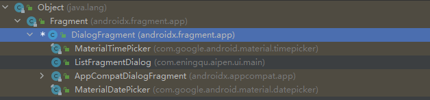

[https://juejin.cn/post/7094450920372568071](https://juejin.cn/post/7094450920372568071)
# 实现方案
官方推荐的实现方案，继承`**DialogFragment**`
**继承结构，**`**DialogFragment**`**是Fragment的子类，因此自定义一个Dialog的流程和创建一个Fragment类似**

主要关注**onCreateDialog()**方法
定义了一个xml布局叫`**R.layout.dialog_list_fragment**`**，其他的就是设置dialog的显示位置，接住了Window整个类。其他的具体看代码。想深入原理详看Window和WindowManager。**
```powershell
public Dialog onCreateDialog(@Nullable Bundle savedInstanceState) {
      Dialog dialog = super.onCreateDialog(savedInstanceState);
      //设置content前设定
      dialog.requestWindowFeature(Window.FEATURE_NO_TITLE);
      View root= LayoutInflater.from(getContext()).inflate(R.layout.dialog_list_fragment,null);
      mRecycleView=root.findViewById(R.id.rvRecycleView);
      mRecycleView.setLayoutManager(new LinearLayoutManager(getContext()));


      dialog.setContentView(root);
      //外部点击取消
      dialog.setCanceledOnTouchOutside(true);
      Window window=dialog.getWindow();
      window.setBackgroundDrawableResource(R.drawable.shape_white_radiu6);
      WindowManager.LayoutParams layoutParams= window.getAttributes();
      //居中
      layoutParams.gravity=Gravity.CENTER;
      //高度宽度持平
      layoutParams.width=(int) (ScreenUtils.getScreenWidth()*0.8);
      window.setAttributes(layoutParams);

      return dialog;
  }
```
效果

## 遇到的问题
快速点击dialog必现奔溃
[https://www.cnblogs.com/ganzhijie/p/14249580.html](https://www.cnblogs.com/ganzhijie/p/14249580.html)
# BRVA 
 一款更快使用RecyclerView的框架
```powershell
//一款更快使用RecyclerView的框架 BRVA
    implementation "com.github.CymChad:BaseRecyclerViewAdapterHelper:2.9.40"
```
[https://github.com/CymChad/BaseRecyclerViewAdapterHelper](https://github.com/CymChad/BaseRecyclerViewAdapterHelper)
# Android Utils
```powershell
implementation 'com.blankj:utilcode:1.26.0'

// if u use AndroidX, use the following
implementation 'com.blankj:utilcodex:1.26.0'

```
[https://www.yuque.com/starryluli/tg8bvk/xn6dgz4lx6bursmp#MtJZf](#MtJZf)
