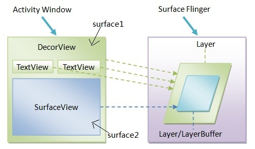

参考资料：[android安卓SurfaceView与view的区别是什么](https://blog.csdn.net/ruiruiddd/article/details/116232738#:~:text=%E5%9C%A8Android,%E6%9D%82%E8%80%8C%E9%AB%98%E6%95%88%E7%9A%84UI%E3%80%82)
参考资料：[Android-View的孪生兄弟---SurfaceView入门](https://zhuanlan.zhihu.com/p/338660090)
# SurfaceView和View最本质的区别在于：
SurfaceView是在一个**新起的单独线程**中可以重新绘制画面，而View必须在UI的主线程中更新画面。那么在UI的主线程中更新画面 可能会引发问题，比如你更新画面的时间过长，那么你的主UI线程会被你正在画的函数阻塞。那么将无法响应按键，触屏等消息。
它拥有独立的绘图表面，即它不与其宿主窗口共享同一个绘图表面，由于拥有独立的绘图表面，因此SurfaceView的UI就可以在一个独立的线程中进行行绘制，由于不占用主线程资源，SurfaceView一方面可以实现复杂而高效的UI。

Activity窗口的顶层视图DecorView及其两个TextView控件都是通过窗口的Surface对应的Canvas绘制在SurfaceFlinger服务中的同一个Layer上，即图中绿色的部分
SurfaceView的UI是通过其自己的Surface对应的Canvas绘制在SurfaceFlinger服务中的另外一个Layer上，图中的蓝色部分。

总结而言，SurfaceView和View的区别主要是：

1. View适用于主动更新的情况，而SurfaceView主要用于被动更新，比如：频繁的刷新.
2. View在主线程里面进行刷新，而SurfaceView主要通过一个子线程来进行页面的刷新
3. View在绘图时没有使用双缓冲机制，而SurfaceView在底层实现机制中已经实现了双缓冲机制 总结起来就是，如果自定义View需要频繁刷新，或者刷新时数据处理大，那就可以考虑使用SurfaceView来取代View。
# SurfaceView中的MVC
SurfaceView的使用离不开Surface和SurfaceHolder，这三者充当的角色分别是：

- Surface：Model
- SurfaceView：View
- SurfaceHolder：Controller
## SurfaceHolder
在SurfaceView中你可以通过SurfaceHolder接口访问它内部的surface，而我们执行绘制的方法就是操作这个 Surface内部的Canvas，处理Canvas画的效果和动画，大小，像素等。
`**getHolder()**`方法可以得到这个SurfaceHolder，通过SurfaceHolder来控制surface的尺寸和格式，或者修改监视surface的变化等等。
Surfaceview一般会继承SurfaceHolder的Callback接口，`**SurfaceHolder.Callback**`具有如下的方法

- surfaceCreated(SurfaceHolder holder)：当Surface第一次创建后会立即调用该函数，可以在该函数中做些和绘制界面相关的初始化工作。
- surfaceChanged(SurfaceHolder holder, int format, int width,int height)：当Surface的状态（大小和格式）发生变化的时候会调用该函数，在surfaceCreated调用后该函数至少会被调用一次。 
- surfaceDestroyed(SurfaceHolder holder)：当Surface被摧毁前会调用该函数，该函数被调用后就不能继续使用Surface了，一般在该函数中来清理使用的资源。 

这里需要注意的是SurfaceView和`**SurfaceHolder.Callback**`的所有回调方法都是在主线程中回调的，在绘制前必须先合法的获取 Surface 才能开始绘制内容。
在使用SurfaceView过程中是不直接和Surface打交道的，由SurfaceHolder的Canvas lockCanvas()或则Canvas lockCanvas(Rect dirty)函数来锁定并且获取Surface中的Canvas画布对象，通过在Canvas上绘制内容来修改Surface中的数据，如果Surface被别的线程占有不可编辑或则尚未创建或者已经被销毁，调用该函数会返回null。
## SurfaceView
SurfaceView类的成员变量`**mRequestedType**`描述的是SurfaceView的绘图表面Surface的类型
成员变量mRequestedType的取值可以是：

- SURFACE_TYPE_NORMAL：用RAM缓存原生数据的普通Surface 
- SURFACE_TYPE_HARDWARE：适用于DMA(Direct memory access )引擎和硬件加速的Surface 
- SURFACE_TYPE_GPU：适用于GPU加速的Surface 
- SURFACE_TYPE_PUSH_BUFFERS：表明该Surface不包含原生数据，Surface用到的数据由其他对象提供。
# Surface的使用步骤

1. 继承SurfaceView，并实现SurfaceHolder.Callback和Runnable
2. 构造函数中执行初始化操作
3. 

## 实现必需接口
```groovy
//Surface第一次创建后会立即调用该函数
@Override
public void surfaceCreated(SurfaceHolder holder) {
    LogUtils.d("surfaceCreated()");
}
//当Surface的状态（大小和格式）发生变化的时候会调用该函数
@Override
public void surfaceChanged(SurfaceHolder holder, int format, int width,
                           int height) {
    LogUtils.d("surfaceChanged()");
}
//当Surface被摧毁前会调用该函数
@Override
public void surfaceDestroyed(SurfaceHolder holder) {
    LogUtils.d("surfaceDestroyed()");
}
```
实现Runnable接口，需要实现下面的方法：
```groovy
@Override
public void run() {
    //子线程
}
```
## 构造函数初始化
初始化操作主要负责通过getHolder()方法拿到SurfaceHolder，并注册其回调方法
```groovy
SurfaceHolder holder = getHolder();//获取到Surface的Holder，控制器
holder.addCallback(this);
```
并且一般做绘制操作，都需要画笔，所以也经常在构造函数中初始化画笔，封装成一个私有函数供构造函数调用。
```groovy
private void createPaint() {
    mPaint = new Paint();
    mPaint.setAntiAlias(GESTURE_RENDERING_ANTIALIAS);
    mPaint.setColor(mPenColor);
    mPaint.setStyle(Paint.Style.STROKE);
    mPaint.setStrokeJoin(Paint.Join.ROUND);
    mPaint.setStrokeCap(Paint.Cap.ROUND);
    mPaint.setStrokeWidth(mPenSize);
    mPaint.setDither(DITHER_FLAG);
}
```
## 新开线程
展开讲讲在`surfaceCreated()`函数会在Surface第一次创建后会立即调用，通常它负责开启一个子线程。
这里利用线程池来创建线程[Android中的线程池](https://www.yuque.com/starryluli/android/eykcuaw5x0d20o0b)[线程创建的开销](https://www.yuque.com/starryluli/android/hxeb5yv0d2d277rm)
```groovy
singleThreadExecutor.execute(new Thread(this));
```
这个this便指代我们创建的Surface，因为它实现了Runnable接口其中的run方法，所以默认创建线程后就会执行run()方法
下面来看看应该在run()方法中做些什么？这个方法用来执行绘制操作，`**isDrawing**`是一个成员变量，用于标记子线程是否绘制
```groovy
/**
 * 子线程中执行具体的绘制笔迹
 */
@Override
public void run() {
    while (isDrawing) {
        draw();
        try {
            Thread.sleep(80);
        } catch (InterruptedException e) {
            e.printStackTrace();
        }
    }

}
```
这里把具体的绘制操作封装成私有函数draw()，可以具体看一下它的实现

1. 通过lockCanvas()方法获得Canvas对象进行绘制
2. 绘制背景
3. 执行所有笔具体的绘制操作
4. 通过unlockCanvasAndPost方法对画布内容进行提交
```groovy
private void draw() {

    synchronized (this) {
        if (isDrawing) {
            try {
                //1.通过lockCanvas()方法获得Canvas对象进行绘制
                canvas = mHolder.lockCanvas();

                if (null == canvas) {
                    return;
                }
                
                //2.绘制背景
                canvas.drawColor(Color.WHITE, PorterDuff.Mode.SRC);
                if (null != mBmpBg) {
                    canvas.drawBitmap(mBmpBg, null, new Rect(0, 0, getWidth(), getHeight()), null);
                }
                
                //3.执行所有笔具体的绘制操作
                foreachStrokes(canvas);

            } catch (Exception e) {
                e.printStackTrace();
            } finally {
                if (canvas != null) {
                    //4.通过unlockCanvasAndPost方法对画布内容进行提交
                    mHolder.unlockCanvasAndPost(canvas);
                }
            }
        }
    }
}
```
## 具体绘制

