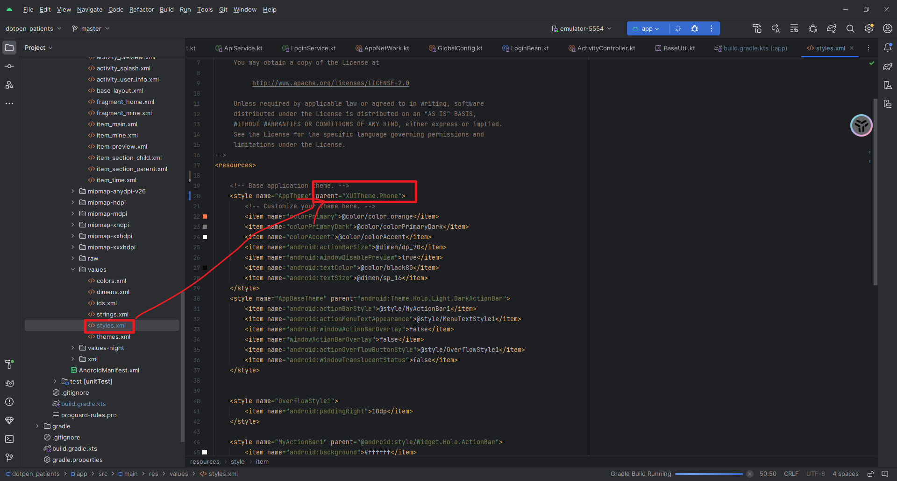
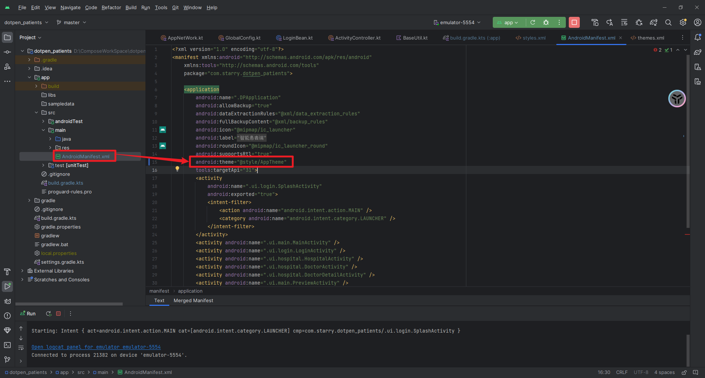

# 官方地址
[https://github.com/xuexiangjys/XUI](https://github.com/xuexiangjys/XUI)
# 接入依赖
```xml
    //androidx项目
    implementation("com.github.xuexiangjys:XUI:1.2.1")
    implementation("com.github.bumptech.glide:glide:4.15.1")
```
# 修改主题
将style标签的parent属性修改为  `XUITheme.Phone`

```xml
<style name="AppTheme" parent="XUITheme.Phone">
 ···
</style>
```
并在manifest中全局应用这个主题风格


# banner
## 適配器
```xml
package com.starry.dotpen_patients.ui.adapter

import android.graphics.Color
import android.graphics.drawable.ColorDrawable
import android.text.TextUtils
import android.view.View
import android.widget.ImageView
import com.starry.dotpen_patients.R
import com.xuexiang.xui.adapter.recyclerview.BaseRecyclerAdapter
import com.xuexiang.xui.adapter.recyclerview.RecyclerViewHolder
import com.xuexiang.xui.widget.banner.recycler.BannerLayout
import com.xuexiang.xui.widget.imageview.ImageLoader
import com.xuexiang.xui.widget.imageview.strategy.DiskCacheStrategyEnum
import java.util.Arrays

class RecyclerViewBannerAdapter : BaseRecyclerAdapter<String?> {
    /**
     * 默认加载图片
     */
    var colorDrawable: ColorDrawable
        private set
    /**
     * 获取是否允许缓存
     *
     * @return
     */
    /**
     * 是否允许进行缓存
     */
    var enableCache = true
        private set
    private var mOnBannerItemClickListener: BannerLayout.OnBannerItemClickListener? = null

    constructor() : super() {
        colorDrawable = ColorDrawable(Color.parseColor("#555555"))
    }

    constructor(list: List<String?>?) : super(list) {
        colorDrawable = ColorDrawable(Color.parseColor("#555555"))
    }

    constructor(list: Array<String?>) : super(Arrays.asList<String>(*list)) {
        colorDrawable = ColorDrawable(Color.parseColor("#555555"))
    }

    /**
     * 适配的布局
     *
     * @param viewType
     * @return
     */
    public override fun getItemLayoutId(viewType: Int): Int {
        return R.layout.item_banner
    }

    /**
     * 绑定数据
     *
     * @param holder
     * @param position
     * @param imgUrl
     */
    override fun bindData(holder: RecyclerViewHolder, position: Int, imgUrl: String?) {
        val imageView = holder.findViewById<ImageView>(R.id.iv_item)
        if (!TextUtils.isEmpty(imgUrl)) {
            ImageLoader.get().loadImage(
                imageView, imgUrl, colorDrawable,
                if (enableCache) DiskCacheStrategyEnum.RESOURCE else DiskCacheStrategyEnum.NONE
            )
        } else {
            imageView.setImageDrawable(colorDrawable)
        }
        imageView.setOnClickListener {
            if (mOnBannerItemClickListener != null) {
                mOnBannerItemClickListener!!.onItemClick(position)
            }
        }
    }

    /**
     * 设置是否允许缓存
     *
     * @param enableCache
     * @return
     */
    fun enableCache(enableCache: Boolean): RecyclerViewBannerAdapter {
        this.enableCache = enableCache
        return this
    }

    fun setColorDrawable(colorDrawable: ColorDrawable): RecyclerViewBannerAdapter {
        this.colorDrawable = colorDrawable
        return this
    }

    fun setOnBannerItemClickListener(onBannerItemClickListener: BannerLayout.OnBannerItemClickListener?): RecyclerViewBannerAdapter {
        mOnBannerItemClickListener = onBannerItemClickListener
        return this
    }
}
```
## 佈局
``
```
<com.xuexiang.xui.widget.banner.recycler.BannerLayout
    android:id="@+id/banner"
    android:layout_width="0dp"
    android:layout_height="200dp"
    android:layout_marginHorizontal="@dimen/dp_20"
    android:layout_marginVertical="@dimen/dp10"
    app:layout_constraintEnd_toEndOf="parent"
    app:layout_constraintStart_toStartOf="parent"
    app:layout_constraintTop_toBottomOf="@+id/tvHospital">

</com.xuexiang.xui.widget.banner.recycler.BannerLayout>
```
## 使用
```xml
    override fun initView() {
        mDataBinding.banner.setAdapter(RecyclerViewBannerAdapter(mViewModel.bannerUrls.value))
    }
```
