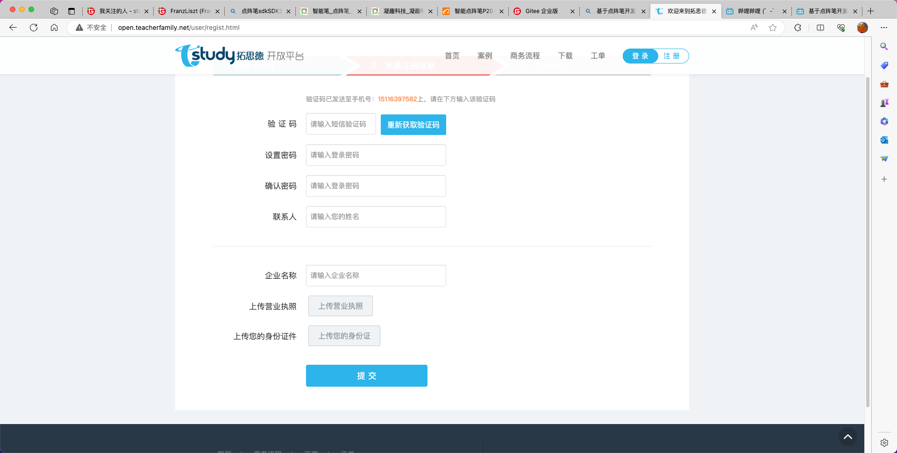
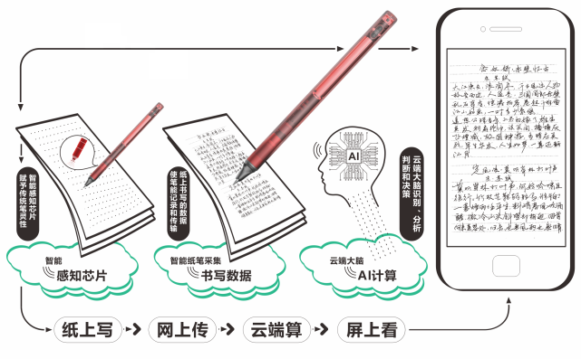
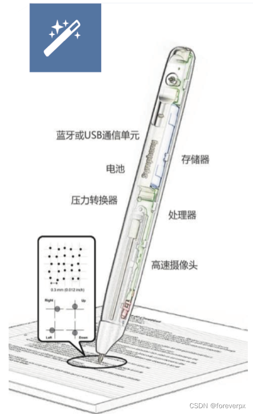
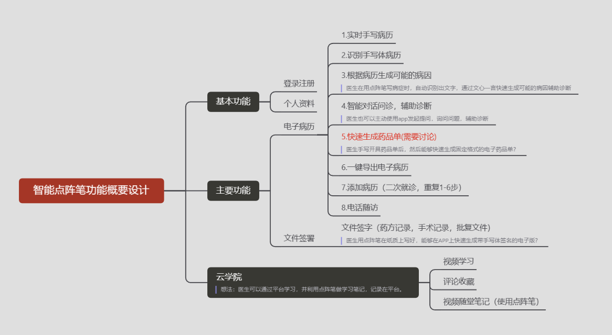
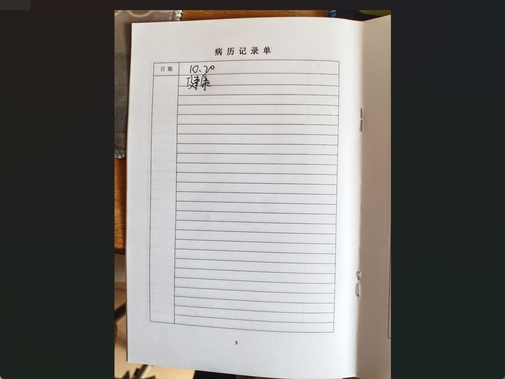
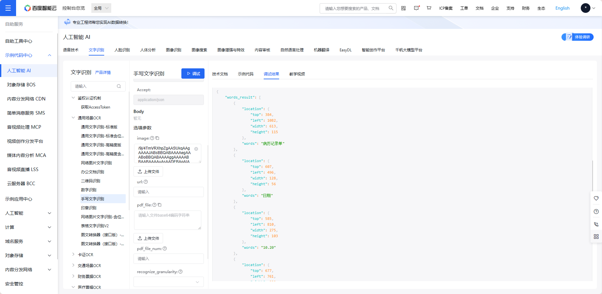

# 选题
 基于点阵笔做Android蓝牙应用  
 在纸上写的字能实时还原到Android中  
 通过一些百度api实时的把手写体文字识别成电子文字  
 查到那种有sdk提供的产品  
# 实现效果
[https://www.tqltech.com/solution/214.html](https://www.tqltech.com/solution/214.html)
[https://www.bilibili.com/video/BV1BN4y1A79f/?spm_id_from=333.337.search-card.all.click&vd_source=2c2d0ce64b817501491ef975f77fea05](https://www.bilibili.com/video/BV1BN4y1A79f/?spm_id_from=333.337.search-card.all.click&vd_source=2c2d0ce64b817501491ef975f77fea05)
# 其他的SDK
sdk
[https://e.gitee.com/tql-team/doc/share/97e5ecd93f81428e/?sub_id=4570524](https://e.gitee.com/tql-team/doc/share/97e5ecd93f81428e/?sub_id=4570524)
[http://open.teacherfamily.net/download/index.html](http://open.teacherfamily.net/download/index.html)

# 什么是点阵笔
将信息通过蓝牙或USB线向外传输的书写工具
一种通过在**普通纸张**上印刷一层**不可见的点阵图案**，数码笔前端的**高速摄像头**随时捕捉笔尖的运动轨迹，同时**压力传感器**将压力数据传回数据处理器，最终将信息通过**蓝牙**或者**USB线**向外传输的新型书写工具
与普通的纸张和笔不同，这些信息包括纸张类型、来源、页码、位置、笔迹坐标、运动轨迹、笔尖压力、笔画顺序、运笔时间、运笔速度等信息，笔迹记录过程与书写过程同步。
当书写时，点阵数码笔将纸张上书写的文字或者图片以**位图**的形式存储在电脑中，形成文档，如需要还可以**同步通过投影显示**。

点阵笔技术及产品解决方案包含芯片、镜头、编码、解码、铺码排版软件、SDK等技术，涉及到**光学、芯片、编码、图像、印刷**等多种技术和工艺类别。

能够实现这一效果首先需要具备两个要素。其一是笔本身，点阵笔由自研的**识别算法芯片、电池、摄像头模块和可更换笔芯**组成，能够实现边写边识别。并且在点阵笔联网后，可作为数据采集的入口，将内容传输到电子终端。在使用手感上，点阵笔的轻重及灵敏度，与中性笔写字相似。
其二是教辅纸张上印刷的**点阵码**。纸上的点码相当于辅助性坐标，通过摄像头与点阵识别一体化芯片识别并解码，获得笔尖附近的坐标，就可以计算出笔迹坐标。并在电子屏还原出原始图像，调取点阵码关联的数据内容，构成空间对应的关系。
上面有提到，笔的内部有一系列的普通笔不具有的元器件，主要是以下这些：

压力传感器：当使用时，压力传感器会判断当前是否为书写状态。在感应到压力时，识别当前为书写状态，让笔开始工作，开启红外成像和点阵码识别。在没有感应到压力时，让笔处于待机状态，节约笔的能耗。
红外摄像机：用于成像点阵码，提供给芯片进行解码识别，定位书写轨迹各个点的坐标。
MCU：也就是计算芯片，接收到红外成像的数据后，计算书写坐标点。
蓝牙 or WIFI：通信模组，作用是将书写坐标点数据发送出去。
电池：供电
存储器：当笔处于离线状态时，用于把在离线状态下书写的坐标点数据暂存在存储器中，等到在线的时候再同步数据到接收端。这样就可以不用让笔每时每刻都在线（连接接收端），想写的时候随时写，不打破书写的节奏和习惯，等后面找机会再同步。

[https://blog.csdn.net/ForeverCjl/article/details/124805828](https://blog.csdn.net/ForeverCjl/article/details/124805828)
# 软件工程
## 开题报告
[https://ims.pumch.cn/detail/10202.html](https://ims.pumch.cn/detail/10202.html)
[https://www.gov.cn/xinwen/2019-08/09/content_5420240.htm#1](https://www.gov.cn/xinwen/2019-08/09/content_5420240.htm#1)
[https://wenku.baidu.com/view/8f1e89f0f524ccbff1218458.html?_wkts_=1701152983075](https://wenku.baidu.com/view/8f1e89f0f524ccbff1218458.html?_wkts_=1701152983075)
## 竞品调研
APP端竞品：**病历夹**、医口袋
网页端：[https://x-emr.cn/](https://x-emr.cn/)
## 可行性分析
略，初步认定可行
## 需求分析
主体是**医护人员**，主要功能是**手写病历转电子病历**，扩展功能需要围绕**主体（医护人员）**
面向的人群主要就是 医护人员 ，对于医护人员，它们经常需要手写病历，而电子病历的主旋律，让手写病历和电子病历之间存在“隔阂”。如何搭建起手写病历和电子病历的桥梁就靠点阵笔技术+文字识别技术
将医护人员的手写的病历，实时捕捉到App上，再通过文字识别技术，将手写的文字一一识别出来，再规范化整理成 电子病历文档，方便构建其电子病历系统，无需再花费人工将手写病历扫描或者键盘输入等方式，转换成电子病历。

## 概要设计
[概要功能设计 - 幕布](https://www.mubu.com/doc/2uHpPpX2Ho)

1. 连接手写笔
2. 实时书写

最终提供给可以是一份只包含手写体的图片，也可以是带病历格式的图片，用于文字识别

3. 一键识别病历（手写字体识别）

手写字体识别，需要传入的是一张图片，Base64编码的字符串，导出的文字是一行一行的。
[服务与支持-自助服务-自助工具](https://console.bce.baidu.com/tools/#/api?product=AI&project=%E6%96%87%E5%AD%97%E8%AF%86%E5%88%AB&parent=%E9%80%9A%E7%94%A8%E5%9C%BA%E6%99%AFOCR&api=rest%2F2.0%2Focr%2Fv1%2Fhandwriting&method=post)有手写识别还有文字识别，可以体验哪一种更好用
如下是手写文字识别的效果

4. 病历规范化整理
5. 文心一言智能对话（还没想好应用场景）
6. 可以考虑增加一个**医生接诊人数**和**每个病人接诊时间**的统计，然后形成一个**各科室医生的排行榜**，公开可以比较
7. 像我们使用的笔记软件一样增加一个**分类记笔记**的功能，医生接诊过的病人的处方会形成一个电子版的小册子，方便医生**存储档案**，纸质版的容易弄丢，针对不同病人医生可以接诊完后随时记录一些自己对病症的处理方法总结一些新路历程（相当于宝贵的临床经验），而且还可以把**不同类型的疾病分类记录**到不同的笔记本中，后面也会方便医生自己查阅，医生间相互交流学习，做成一个医生经验交流的平台
8. 考虑是否需要增加一个录音功能或者**插入图片**的功能，因为现在医生看病印象中会在检查报告单上面写一些诊断结果，像胃镜，血液检测，如果能把所有的检查结果影像和数据都汇总到点阵笔的电子笔记上会不会对医生和患者来说更方便一些

## 详细设计
[https://blog.csdn.net/licongzhuo/article/details/130030160](https://blog.csdn.net/licongzhuo/article/details/130030160)

