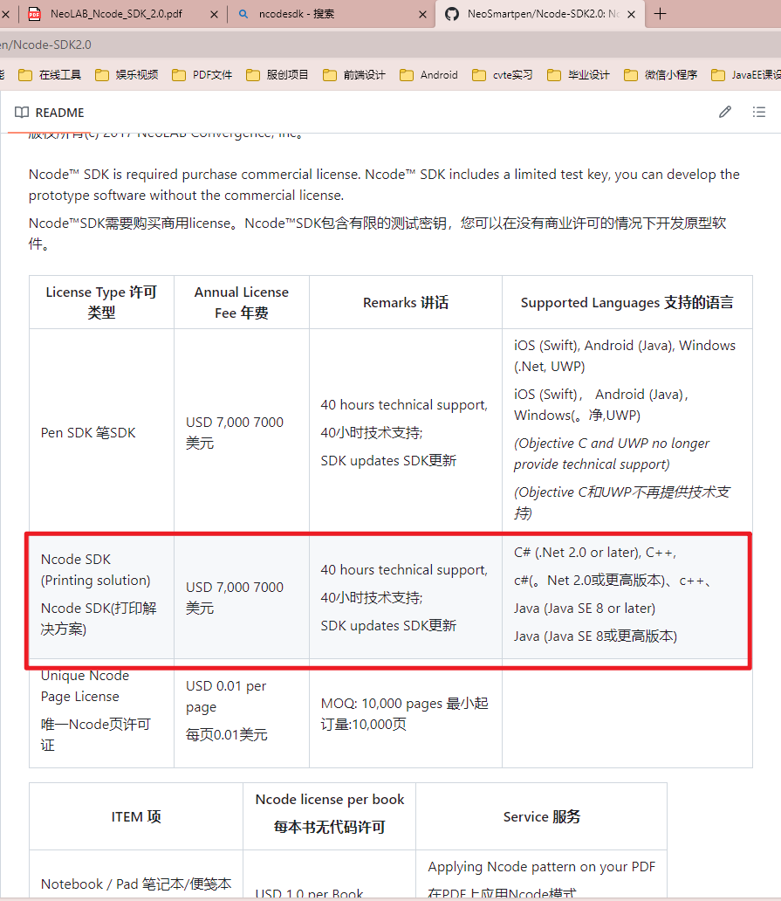
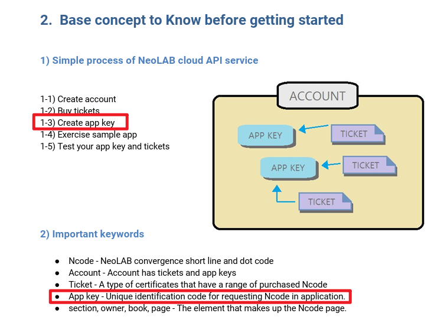
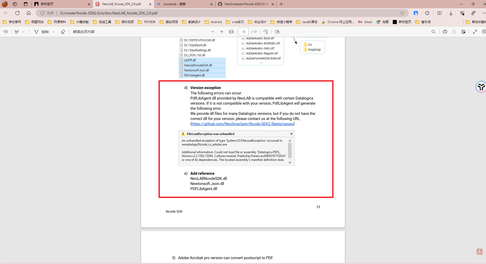
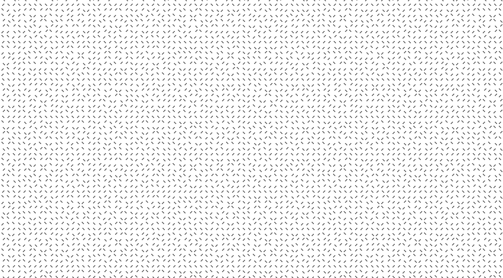

下载可打印的点阵纸
[https://neosmartpen.com/ncode-pdf/](https://neosmartpen.com/ncode-pdf/)

打印解决方案
[https://github.com/NeoSmartpen/Ncode-SDK2.0](https://github.com/NeoSmartpen/Ncode-SDK2.0)

项目指导文档

运行起来报错

使用cs项目跑出来的点阵纸，点阵如下

