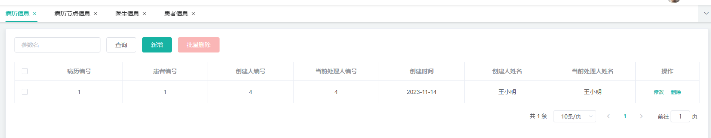

病人
医生
病历（病历以病历id为主键）每一次就诊都会生成一个信息节点
病历信息节点：信息节点保证  病人 -- 医生 -- 此次就诊  一一对应
[数据库表.docx](https://www.yuque.com/attachments/yuque/0/2023/docx/32682386/1699968600797-aa34a7f9-b5db-4424-a697-0448289b1986.docx?_lake_card=%7B%22src%22%3A%22https%3A%2F%2Fwww.yuque.com%2Fattachments%2Fyuque%2F0%2F2023%2Fdocx%2F32682386%2F1699968600797-aa34a7f9-b5db-4424-a697-0448289b1986.docx%22%2C%22name%22%3A%22%E6%95%B0%E6%8D%AE%E5%BA%93%E8%A1%A8.docx%22%2C%22size%22%3A251783%2C%22ext%22%3A%22docx%22%2C%22source%22%3A%22%22%2C%22status%22%3A%22done%22%2C%22download%22%3Atrue%2C%22taskId%22%3A%22u7e47f50d-e79f-4315-baab-271b9c836f2%22%2C%22taskType%22%3A%22upload%22%2C%22type%22%3A%22application%2Fvnd.openxmlformats-officedocument.wordprocessingml.document%22%2C%22__spacing%22%3A%22both%22%2C%22mode%22%3A%22title%22%2C%22id%22%3A%22u818e3663%22%2C%22margin%22%3A%7B%22top%22%3Atrue%2C%22bottom%22%3Atrue%7D%2C%22card%22%3A%22file%22%7D)

## 病历表设计
对于病历表-由后台预置，模拟用户在前台挂号
第一次挂号操作会触发：患者账号注册，病历单生成，并创建**初始病历节点**，自动关联用户挂号的医生
医生端能对病历表做查询，根据当前处理人编号查询得到，待看病的病人列表。按时间排序。
如果是第二次来看病，那么就会自动在病历表下生成一个新的病历信息节点，关联病历表的编号
因此病历表和病历节点表是1：n的关系。

